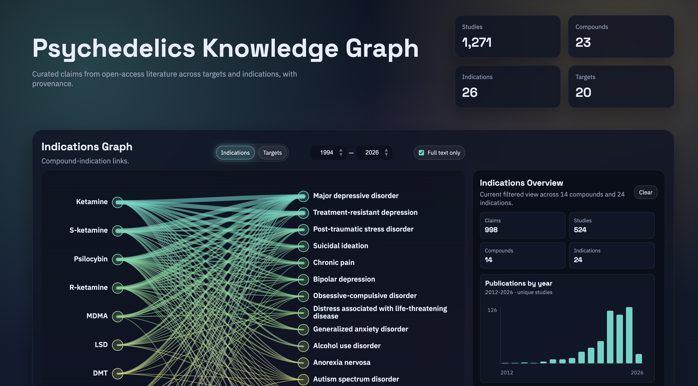

# Psychedelics Knowledge Graph

A provenance-aware literature pipeline and web interface for exploring
structured findings about psychedelics, mechanisms, and mental health outcomes.

[Live GUI](https://povilaskarvelis.github.io/psychedelics_knowledge_graph/ui) |
[Pipeline Guide](pipeline/README.md) |
[Search Seed Strategy](docs/search_seed_strategy.md) |
[Search Completeness](docs/search_completeness.md) |
[Evidence Policy](docs/evidence_policy.md) |
[Terminology](docs/terminology.md) |
[Deployment](docs/deployment.md)



## Overview

This repository explores how evidence synthesis can work in the age of
agentic science. Expert review papers remain essential for interpretation,
argument, and judgment. The evidence base underneath those reviews can also
become more structured, inspectable, and reusable: a living substrate that can
be updated as new literature appears while preserving provenance.

The goal is an evidence base that is useful in two directions. Humans need an
interactive way to navigate the evidence landscape. Agents need structured
paper, evidence, entity, and provenance records they can query, extend, and
build upon. The pipeline is documented, transparent, and open-source, with
community feedback treated as part of the maintenance model.

Psychedelics research is the case study. The project builds a knowledge graph
of the literature across clinical indications and mechanistic targets, while
preserving paper-level provenance, screening decisions, evidence records, and
finding-level structure. This helps reduce evidence fragmentation, surface null,
mixed, uncertain, and positive findings, and make the evidence base reproducible
for both human review and agentic workflows.

The project builds on existing traditions in biomedical knowledge graphs,
literature mining, systematic mapping, and living evidence synthesis. Its
contribution is the domain-specific combination: automated literature discovery,
DOI-context screening, LLM-assisted structured evidence extraction, validation
gates, normalized graph views, PRISMA-style auditability, and a public
interactive interface for psychedelic research.

## Knowledge Graph Architecture

The project is intended to build a provenance-aware knowledge graph with a
digestible public visualization layer. The visual graph is a readable view over
a larger graph-shaped data model.

The KG has several layers:

- `Paper` records capture literature metadata, discovery provenance, screening
  status, PDF/full-text availability, publication type, and study context.
- `Evidence record` rows capture extracted study findings from papers, with
  evidence locators, source family, paper type, study design, result direction,
  assay/outcome fields, confidence, and validation status.
- Canonical entity nodes represent compounds, clinical indications, mechanistic
  targets, papers, and evidence records using stable identifiers.
- Semantic edges aggregate evidence into relationships such as
  `compound -> indication` and `compound -> target`.
- View payloads turn the canonical KG into readable interfaces, including the
  main graph and the Methods paper flow.

This separation matters. The canonical KG can grow as more papers and evidence
records are screened, extracted, corrected, or updated. The UI can summarize
important KG components while preserving the underlying provenance.

The public graph payloads are built from normalized evidence tables, while the
methods projection focuses on auditability and paper-flow status.

## Workflow

### Literature Search

Discovery scripts query multiple literature APIs, generate DOI-context queues,
and build a local paper library with titles, abstracts, access metadata, and
PDFs when available.

At the conceptual level:

- the literature search uses source-specific query modules in OpenAlex and
  PubMed, combining psychedelic compound/class synonyms with target or
  indication vocabularies and evidence terms
- dense high-yield modules are run deeper than broad primary modules, while
  direct compound-target and compound-indication searches include rare
  combinations
- search results are matched by DOI before papers are added; duplicate records
  are logged, while new papers move forward for review
- bibliographic details are added before abstract screening from metadata
  providers such as PubMed/PMC, Unpaywall, Crossref, OpenAlex, and Semantic
  Scholar; full text is checked after abstract screening
- retrieval provenance is retained in discovery reports and ledgers

Technical note: search and sync live in `pipeline/ingest/` and write to
`data/processed/paper_library_*.json` plus local PDFs under `data/raw/papers/`.

### Screening Papers

Retrieved papers now move through abstract screening before PDF acquisition.
The old rule-based triage remains available for legacy audits, but it is not
the default gate for the live graph. Abstract screening works at the
`(DOI, compound, target/disorder)` context level so one paper can support
multiple graph edges while preserving DOI-context distinctions.

Current source and paper-type labels separate primary empirical evidence,
secondary literature, and non-primary context. Common paper types include:

- primary results
- systematic review, review, or meta-analysis
- protocol
- conference or poster abstract
- case report, commentary, or correction
- other

Only primary results papers are admitted to the default primary-evidence graph.
Reviews, systematic reviews, and meta-analyses are retained as secondary
literature and can be included with the secondary-source view/checkmark.
Protocols, conference abstracts, commentary, and corrections are retained as
non-primary context where possible, with primary-evidence counts kept separate.

Technical note: the current default path is non-destructive. It uses a
deterministic no-signal pre-screen, then local LLM abstract screening for
relevance and quote-supported contexts only. Full-text eligibility assessment,
source-family labeling, evidence-strength labeling, and data extraction happen
later from PDFs or abstract-only fallback evidence.

### Structured Evidence Extraction

The pipeline seeds one evidence-record stub per DOI-context and fills structured
fields from abstracts first, then PDFs when full-text evidence is needed. The
full-text LLM step is best described as full-text evidence assessment plus data
extraction; use `adjudication` only for the final conflict-resolution decision
when model/rule/curator outputs disagree.

Local PDFs are converted into structured full-text artifacts with GROBID as the
primary scholarly-article parser. GROBID preserves TEI XML with article
sections, tables, figures, references, and other locators that downstream
evidence packets use for auditable extraction.

- mechanistic evidence records capture compound-target assay findings
- disorder evidence records capture compound-disorder outcome findings
- disorder evidence records include a lightweight `result_direction` label:
  `positive`, `null`, `negative`, `mixed`, `unclear`
- each row keeps a provenance locator back to text, table, figure, or abstract
- bibliographic and synthesis fields include journal, publication type, trial
  registry IDs, sample size, comparator/intervention details, outcomes, effect
  sizes, adverse events, funding, conflicts of interest, and risk-of-bias notes
- PDF-heavy extraction scripts auto-run inside the `psychkg-pdf` conda
  environment when it exists

The current extraction approach is schema-driven and conservative. The output is
meant to be auditable and easy to improve over time.

### Validation and Outputs

Curated rows are checked against JSON schemas and evidence-policy rules before
publication.

Main outputs:

- browser interface in `ui/`
- curated evidence-record files in `data/curated/`
- exploratory evidence-record files for weak or demoted evidence
- graph export payloads in `data/processed/graph_payload_*.json`
- interim bibliography payloads in
  `data/processed/bibliography_payload_*.json`
- methods paper-flow files in `data/kg/` when
  `python pipeline/kg/build_methods_flow.py --refresh-kg-tables` is run locally
- the GUI defaults to primary evidence and has a `Secondary sources` checkbox
  for reviews, systematic reviews, and meta-analyses

The GUI defaults to a stricter primary-results-only view and surfaces paper
type and result direction directly in the interface.

## Repository Layout

- `pipeline/ingest/`: discovery, paper sync, DOI seeding
- `pipeline/review/`: abstract screening, legacy triage audit, and autofill
- `pipeline/extract/`: promotion into curated evidence records
- `pipeline/validate/`: validation, cleanup, and audit helpers
- `pipeline/publish/`: export
- `schema/`: legacy claim schemas and normalization rules
- `ui/`: browser interface
- `data/curated/`: main and exploratory evidence-record sets
- `data/processed/`: paper libraries, reports, stubs, and export payloads

## Quick Start

Requirements:

- Python 3.10+ for the core pipeline
- optional `psychkg-pdf` conda environment for PDF-heavy extraction
- local credentials in `pipeline/config.local.yaml` for API keys/emails

Minimal current flow for one dataset after credentials are configured:

```bash
python pipeline/ingest/run_extensive_search.py --dataset disorder --provider hybrid --discover-only
python pipeline/ingest/sync_paper_library.py --dataset disorder --skip-download
python pipeline/review/run_local_llm_abstract_screening.py --dataset disorder --deterministic-prescreen --deterministic-prescreen-only --only-with-abstract --only-undownloaded
python pipeline/review/run_local_llm_abstract_screening.py --dataset disorder --doi-file data/raw/doi_queue.disorder.deterministic_prescreen_retained.txt --model qwen3:14b --only-with-abstract --continue-on-error --timeout-sec 0 --resume-from-checkpoint --num-ctx 4096
python pipeline/ingest/sync_paper_library.py --dataset disorder --doi-file data/raw/doi_queue.disorder.llm_fulltext_candidates.txt
python pipeline/ingest/seed_from_dois.py --dataset disorder --doi-file data/raw/doi_queue.disorder.llm_relevant.txt --replace
python pipeline/review/autofill_stubs_from_abstracts.py --dataset disorder --mark-ready --apply
python pipeline/review/autofill_disorder_from_pdfs.py --dataset disorder --mark-ready --apply
python pipeline/review/curation_queue.py --dataset disorder
python pipeline/extract/promote_ready_stubs.py --dataset disorder --apply
python pipeline/validate/validate_claims.py
python pipeline/kg/build_evidence_tables.py
python pipeline/kg/build_author_tables.py
python pipeline/publish/export_graph_payload.py
python pipeline/publish/export_bibliography_payload.py
```

For the operational walkthrough, search completeness checks, provider settings,
PDF runtime setup, and larger search runs, see [pipeline/README.md](pipeline/README.md).
