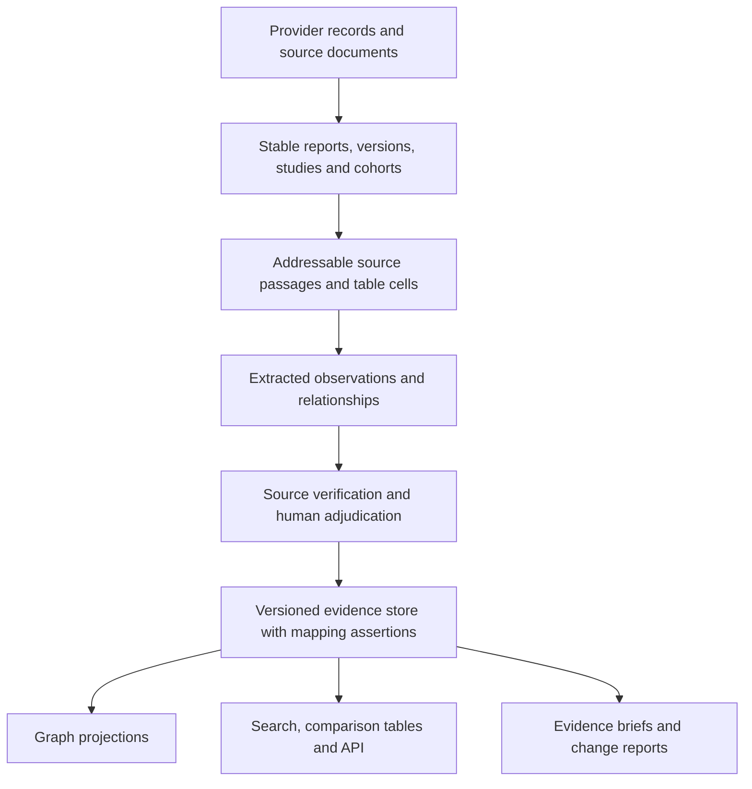

**Critical assessment of Psychedelics Knowledge Graph — 5 September 2026**

The project has built a substantial foundation for a maintained, inspectable research resource. Its strongest assets are the source-processing infrastructure, accumulated structured evidence, domain knowledge, and ability to revisit individual reports. The next major gain will come from establishing the reliability and usefulness of that evidence. More extraction volume and more visualizations will have diminishing value until those questions are addressed.

My recommended goal is: **help researchers establish what evidence exists, what it actually supports, where uncertainty comes from, and what changed since they last checked.** That goal gives the ontology, extraction process, interface, and update schedule a common purpose.

**Basis and limits of this assessment**

I inspected the README, public About/Methods/API pages, pipeline runbooks, extraction prompts and schemas, evaluation reports, discovery and screening logic, normalization and publication code, the API contract, and the browser/analysis implementation. I queried the active local corpus and inspected the public graph. I checked selected findings against original publisher texts and ran the Python regression suite.

The repository HEAD was `de46334cb910f9efb51949be8ba4eb759d9a458c`. The active evidence run was `full_corpus_normalization_patch_qa_20260724`; the public literature date was 2026-07-15. UI files were being edited concurrently, so observations distinguish the live website from the local implementation. No pipeline, production data, or website files were changed by this assessment.

This is an architectural, methodological, and product assessment with diagnostic source checks. It is **not a representative accuracy study**. The examples establish that particular failures exist; they do not estimate their prevalence. I did not interview users, measure retention, audit every finding, rerun paid extraction, or test production load. Recommendations about demand are hypotheses to validate.

The accompanying [evidence file](/Users/frank/Library/CloudStorage/Dropbox/projects/psychedelics_knowledge_graph/docs/evaluation/project_critical_assessment_2026-09-05_evidence.json) contains read-only SQL, counts, diagnostic finding IDs, test results, and hashes of the inspected source artifacts.

**What exists today**

| Observation | Measured state | Interpretation |
|---|---:|---|
| DOI-bearing candidate ledger | 268,221 records | A substantial discovery corpus; these are not all eligible reports. |
| Records awaiting identifier resolution | 60,796 | Retained separately, without a standard downstream path through screening. |
| Excluded for no usable abstract | 86,584 | 32.3% of the DOI ledger; relevance of this excluded group is unknown. |
| Excluded for non-English language | 7,440 | A real coverage restriction that should be explicit in public methods. |
| Reports with normalized findings | 21,383 | Matches the total publication count observed on the live website. |
| Normalized findings | 97,195 | Includes deterministic expansions and projections; not 97,195 independent results. |
| Primary reports represented | 16,510 | 9,029 use abstracts only: 54.7%. |
| Primary findings | 82,297 | None populate the dedicated `supporting_quote` field. Locators and summaries are retained. |
| Normalization-audit rows | 24,672 | Mixed reasons including valid scope exclusions and unresolved mappings; not a simple error or loss rate. |
| Reports occurring only in the normalization audit | 1,318 | A useful review queue; not automatically evidence that these reports should be displayed. |
| Reports represented in the overview projection | 18,225 | The overview is a selected subset of the normalized evidence. |
| Python tests | 1,105 passed; 2 failed; 367 subtests passed | Strong regression coverage, with two UI assertions failing at inspection. |

**The strongest points**

1. **The pipeline anticipates real operational failures.** Search runs preserve provider/query provenance, reconcile retrieved IDs, partition large queries, checkpoint progress, and distinguish paused work from completed work. Full-text identity checks, explicit source-depth handling, scoped paper replacement, and coordinated release promotion address failures that simpler literature tools often leave implicit. Preserve this infrastructure.

2. **Scientific distinctions already have a place in the data.** Primary findings, review relationships, and meta-analysis results follow different paths. Comparators, populations, timing, null findings, synthesis limitations, and non-atomic exposures are not all collapsed into a generic positive edge. The meta-analysis contract is particularly useful groundwork for a richer result model.

3. **Saved intermediate evidence permits correction without repeated model calls.** This is an important economic and scientific advantage. The scoped updater and deterministic rebuild paths can turn improved terminology or corrected source interpretation into a new release without paying to rediscover everything.

4. **The project has demonstrated willingness to simplify a failing design.** The review pipeline moved from domain slices to a paper-centered approach. The documented one-pass comparison reduced tokens by 24.6% while the development assessment moved from 75 to 77 “good” papers out of 100. This is a useful engineering result, although it is not independent validation. The earlier poor review-normalization results should not be presented as current production accuracy. See the [later review evaluation](/Users/frank/Library/CloudStorage/Dropbox/projects/psychedelics_knowledge_graph/docs/evaluation/review_relationships_v2_context_first_onepass_100_results.md).

5. **There is already useful breadth.** Molecular, clinical, experiential, behavioral, safety, and real-world research can be explored together. Funding assertions, author identities, trial identifiers, and open-science metadata also exist. These should be improved and connected rather than described as entirely missing features.

**Weakest link 1: the evidence for accuracy is weaker than the evidence for pipeline consistency**

The primary runner validates JSON/schema shape, corrupt output, some category inconsistencies, and model-generated source-mismatch warnings. These are valuable checks. They do not establish that a reported number belongs to the stated population, that a conclusion has the right strength, or that the most important result was captured.

The primary schema requests a location and locator, but no supporting quotation. In the active primary findings, the dedicated quote field is empty throughout. Common locators include `Abstract`, `Table 2`, and chunk IDs such as `C009`. These support investigation; they do not themselves demonstrate source entailment.

The internal evaluation vocabulary also needs tightening. One prominent “manual” assessment explicitly identifies its annotator as Codex. “No evaluator model was used” does not mean a human expert performed the assessment: direct Codex inspection remains model-based assessment. The review experiments are useful development diagnostics, but repeated tuning against the same cohorts makes them weaker evidence of generalization. I did not find a clearly documented, representative, independently human-adjudicated end-to-end benchmark across the current primary pipeline and its exclusions.

The [primary projection assessment](/Users/frank/Library/CloudStorage/Dropbox/projects/psychedelics_knowledge_graph/docs/evaluation/deterministic_projection_primary_assessment.md) correctly states that its coverage gains do not establish paper-level recall. That distinction should govern public validation language too.

**Change:** create a stable evaluation program with separate measures for screening false negatives, source selection, extraction completeness, attribution, numerical fidelity, normalization meaning, and final user answers. Use independent domain reviewers for a bounded benchmark, adjudicate disagreements, and retain a fresh holdout after prompt development. Sample exclusions as well as included papers. Preserve a random component for estimating error rates and a separate targeted challenge set for rare but serious failures. Report denominators and uncertainty; do not combine these into a single “accuracy” score.

For extraction, retain source passages or table cells with document hashes and stable locators. Check exact numerical tokens, units, arm/sample correspondence, and source support before publication. A second model can help prioritize disagreement, but agreement between two models is not ground truth. Escalate ambiguous and consequential findings selectively rather than adding another call to every paper.

**Weakest link 2: normalization sometimes changes the proposition**

Two current examples make this concrete.

**A pooled result becomes condition-specific evidence.** For DOI `10.1007/s00213-020-05611-y`, the original report describes 25 patients with mixed diagnoses and reports an overall depression-score change. The active graph repeats that pooled statistic and total sample size under several diagnosis nodes. The source separately reports a different bipolar-subgroup change; the pooled value therefore cannot serve as that subgroup estimate. The same report's urinary-marker results also appear as clinical condition findings. These are questions of attribution and domain meaning, not JSON validity. [Original report](https://link.springer.com/article/10.1007/s00213-020-05611-y).

The registry additionally treats “recurrent depressive disorder” as an alias of “Persistent depressive disorder.” These categories should not be equated. The mapping is visible in the [entity registry](/Users/frank/Library/CloudStorage/Dropbox/projects/psychedelics_knowledge_graph/data/curated/entity_registry.json:1573); WHO's classification distinguishes recurrent depressive disorders from dysthymia. [WHO diagnostic classification](https://cdn.who.int/media/docs/default-source/classification/other-classifications/9241544228_eng.pdf).

The expansion mechanism is explicit in [condition_expanded_rows](/Users/frank/Library/CloudStorage/Dropbox/projects/psychedelics_knowledge_graph/pipeline/kg/build_evidence_tables.py:7636): it copies a result once for each recognized condition. The active corpus contains 520 rows from 123 reports tagged `condition_text_split`. That is an audit target, not a claim that every such row is wrong.

**A unit is corrupted in a published finding.** For DOI `10.3389/fpsyt.2021.735427`, the publisher text reports an LSD quantity in micrograms. The active dose string contains `10\u0000g LSD`; the public interface displayed `10g LSD`. This is a transcription/unit error, not a dose recommendation. The same null character is present in the browser payload. [Original report, substance-use results](https://www.frontiersin.org/journals/psychiatry/articles/10.3389/fpsyt.2021.735427/full).

A scan found disallowed control characters in 57 dose fields from 17 reports and 28 effect-statistic fields from 9 reports. Not all control characters imply a changed unit, but these findings require inspection. The current runner rejects such characters in new outputs; older carried-forward findings still need the same release-level checks.

**Change:** distinguish concept indexing from result attribution. A mixed cohort may be indexed under several diagnoses while retaining one pooled result and an explicit `pooled_population` role. Create subgroup results only when the source supplies subgroup-specific evidence. Record every normalization assertion as exact equivalence, broader concept, narrower concept, contextual association, or unresolved mapping. Parent relationships must not silently act as synonyms. Validate carried-forward data at release time, and send corrupt scientific quantities back to their source instead of merely deleting the offending character.

**Weakest link 3: the unit of evidence is still usually a report**

The terminology document correctly distinguishes records, reports, and studies. Implementation frequently identifies a “study” by DOI, with OpenAlex ID or title/year fallbacks. The exporter and analysis index therefore measure reports. Two reports from one trial can satisfy a two-“study” display threshold, and repeated reports can inflate apparent independent support.

This is already relevant to the corpus. Registry ID `NCT03429075` occurs with the main psilocybin-versus-escitalopram report, follow-up and secondary analyses, and reviews discussing the trial. Across existing metadata, 199 NCT identifiers are associated with more than one paper. These are candidate links: a trial identifier mentioned in a review must not cause that review to be merged into the trial.

Cochrane explicitly treats the study as the underlying unit and links its multiple reports. The same distinction is needed here before counts become evidence-strength claims. [Cochrane, collecting data](https://training.cochrane.org/handbook/current/chapter-05).

**Change:** add stable study/cohort and experiment identities, with typed report relations such as `reports_primary_results`, `reports_follow_up`, `secondary_analysis_of`, and `discusses_trial`. Allow one report to describe multiple studies. Connect syntheses to their included studies when the inclusion list is available. Keep unknown dependencies explicit. This enables independent-study counts, overlapping-review detection, selective retraction propagation, and more credible gap analysis.

Until then, use “reports” or “publications” in count labels and explain that independence is unresolved. A two-report threshold is a presentation rule, not an assessment of certainty or replication.

**Weakest link 4: several selection mechanisms can be mistaken for scientific gaps**

The discovery implementation is careful about mechanical completeness. Its documentation also correctly retires a small known-record pilot as a recall estimate. However, there is still no defensible estimate of how much relevant research the overall search-and-screening process misses.

The standard path is DOI-centered. Records without DOIs are preserved, which is good, but remain outside the ordinary candidate/screening handoff. There are 60,796 such unresolved records. Many will be duplicates or irrelevant; their number alone says nothing about missed eligible research.

The abstract threshold creates another gate. An otherwise usable report can be excluded because its abstract is absent or shorter than 50 words, before full-text retrieval. Of the 86,584 records excluded for abstract availability/quality, 172 have a local-PDF flag. Those flags do not establish relevance or usable text, but they demonstrate why abstract availability should be a recoverable processing state rather than an eligibility conclusion.

Non-English exclusions and provider coverage further shape the corpus. For an international field with historical and community research, these choices need explicit justification and auditing. The public Methods screening description does not currently explain the English restriction or 50-word threshold.

Finally, the local analysis index is built from graph-admitted rows and excludes pharmacokinetics. The overview also applies support thresholds and vocabulary constraints. An empty cell can therefore mean “not retrieved,” “not extracted,” “not normalized,” “suppressed for display,” or “no study found.” These meanings must remain separate.

**Change:** give every discovered report an internal ID independent of DOI. Extend the existing canonical workflow rather than creating another disconnected ledger. Add title-led/full-text-assisted triage for promising no-abstract records and a prioritized no-DOI resolution path. Audit exclusions by rule, period, language, compound, and domain. Compare against independently assembled relevant sets and citation trails. Additional databases should earn their place through unique eligible yield and effort, with information-specialist input if comprehensive review claims are intended. [Cochrane search guidance](https://www.cochrane.org/authors/handbooks-and-manuals/handbook/current/chapter-04).

Build discovery and landscape analyses from eligible reports plus independent topic annotations. Apply graph-display thresholds only in graph views. Show coverage limitations alongside proposed research gaps.

**Weakest link 5: scientific meaning is distributed across too many transformations**

The graph remains predominantly compound-to-concept. This is useful for navigation but compresses the relationships researchers often care about: exposure versus comparator, result in a specific population, a modifier of an effect, a within-study association, or evidence supporting a mechanistic step.

For clinical primary results, `effect_or_statistic` is free text. A populated field may contain a p-value, a change score, a count, or several statistics. None of the 9,656 primary clinical rows populate the dedicated confidence-interval field; some intervals may still exist inside free text. A reported-statistic field is therefore not yet a reliably comparable effect estimate.

Separating positive, null, and mixed results is useful, but counting these categories cannot resolve differences in design, comparator, sample overlap, endpoint, follow-up, or bias. “No detected effect,” “not measured,” “not reported,” and “not extracted” are different states. Risk-of-bias summaries copied from a meta-analysis also differ from the project's own appraisal of that analysis or its underlying studies.

**Change:** make a source-backed observation/result the canonical scientific object. Give it typed links to exposure/arm, comparator, population/model, outcome/assay, time, statistic, and source. Preserve qualitative findings and research-context claims with appropriate domain-specific forms. Represent evidence status and appraisal provenance separately from effect direction. Derive compound–concept edges from these objects using explicit projection policies.

A path connecting a receptor, brain measure, and clinical outcome should support hypothesis exploration only to the extent that the underlying studies actually connect those steps. Mere co-occurrence across papers cannot establish a causal chain.

**Architecture: evolve the scientific model while keeping the operational backbone**

The normalized-table and static-release approach fits the present workload. I see no evidence that adopting a graph database or splitting the project into microservices would address its main limitations. The costly complexity is semantic and operational ownership.

At inspection, `build_evidence_tables.py` was about 10,900 lines and `ui/app.js` about 13,900. Size alone is not the defect: scientific classifications and fallback interpretations are implemented in both Python and browser JavaScript. A frontend change can consequently affect how evidence is categorized. Large mutable Parquet ledgers also require careful whole-file reconciliation; the current promotion lock and atomic writes help, but they are not a general transaction boundary for every pipeline stage.

The target arrangement should be:

Adopt this incrementally:

- Extract normalization, typed result handling, mapping assertions, and graph projection into modules with clear inputs and outputs. Generate display facets from one shared contract; make the browser primarily render and filter them.
- Retain Parquet/DuckDB for analytical snapshots. If multiple workers or curators need concurrent state changes, move jobs, decisions, overrides, and identity assertions behind one transactional writer or a small transactional database. Preserve the existing decision history and artifacts through migration.
- Extend existing fingerprints and manifests to cover the complete build recipe: source content, parser, prompt/schema, model configuration, vocabulary/projection rules, code revision, and evaluation version. The project already fingerprints extraction inputs and contracts; consolidate this into release-level reproducibility rather than introducing another version system.
- Add a release gate that validates the complete candidate dataset, including historical overlays. A clean new batch must not grandfather unsafe old values.
- Add a pinned pipeline environment, one documented setup command, a small distributable fixture corpus, and CI. I found service-specific requirements and an API Dockerfile, but no repository-wide locked pipeline environment or tracked CI workflow.
- Supplement string-based UI assertions with a few behavioral browser tests: filtering, cohort consistency, source-detail opening, and keyboard navigation. The two observed failures concerned favicon markup and responsive-layout expectations; they do not imply that the whole pipeline is broken.

The all-primary detail artifact is about 67.9 MB uncompressed. Per-view shards and compact encodings already mitigate initial loading. Measure actual transfer, memory, and interaction latency before changing delivery. Broad search is a good candidate for a paginated server index when full browser expansion becomes expensive.

**A more effective operating process**

The process should allocate effort according to evidence value and uncertainty, not simply the number of records available to process.

Maintain broad, inexpensive report discovery and topic indexing. Perform deeper extraction first for defined user questions and high-value evidence slices. Preserve other eligible reports as discoverable records even when their detailed extraction remains pending. Reuse a paper's source structure across domains; pilot a shared primary-study frame where repeated domain calls produce inconsistent populations or endpoints. Keep the tested paper-centered review path unless a fresh benchmark supports a change.

Prioritize review with concrete signals: corrupted quantities, uncertain identifiers, pooled-to-subgroup projection, contradictory source passages, unusual entity mappings, missing central results, and heavily used findings. Add random audits so the review queue does not become blind to unexpected failures. Record human time, total cost, and elapsed time per accepted result, not only tokens per extraction.

Turn corrections into durable assets: corrected evidence objects, adjudicated examples, mapping assertions, and regression cases. An ever-growing prompt or regex file should not be the only place the project remembers a scientific distinction.

Define an update cadence and report completion separately for search, screening, extraction, validation, and publication. At inspection, the public literature date was 52 days before the assessment. That is a freshness observation, not evidence of an update failure. A “living” service becomes more useful when users know its promised cadence, current backlog, and which topics have received deeper review.

**Interface and openness**

The live graph is visually coherent and exposes useful contextual filters. It also makes a new user interpret a large web of connections before choosing a concrete research question. Task entry points would improve usefulness: “Compare evidence,” “Find studies for a review,” and “What changed?” Searchable tables and source-centered report pages should be first-class views alongside the graph.

The live page initially selected “Open access.” The implementation equates that with full text seen by the pipeline; the analysis index similarly derives its `open` flag from extraction depth. Legal/public access and extraction input depth are different properties. Label and filter them independently, and use the complete included corpus as the research default unless the user explicitly selects a restriction.

Funder metadata is already useful, but the public list showed both “National Institute of Mental Health” and “NIMH NIH HHS.” Organizational aliases and parent relationships need normalization before funder rankings become portfolio intelligence. Author panels should similarly disclose when they count first/last authors rather than every contributor.

The public API deliberately omits granular findings, statistics, quotations, and result direction. That is an honest and defensible publication boundary, but it limits the API's ability to deliver the project's distinctive scientific value. An agent using it can locate papers and relationships; it cannot independently reproduce a result-level synthesis from that contract. See the [agent guide](/Users/frank/Library/CloudStorage/Dropbox/projects/psychedelics_knowledge_graph/api/agent-guide.md:3).

After field and rights review, release a useful minimum evidence contract: stable result IDs, typed context, source locators, mapping provenance, validation status, and versioned changes. Provide at least a small, reusable benchmark and reproducible snapshot. Open code, reproducible extraction artifacts, and openly reusable evidence are separate promises; describe exactly which are available. Preserve the current allowlisting and publication safeguards.

**Who benefits, and from what?**

| Audience | Useful job now | Most valuable next step |
|---|---|---|
| Researchers, trainees, labs | Orientation and locating relevant reports across domains | Source-backed comparisons, saved questions, exports, updates |
| Systematic reviewers | Scoping and candidate discovery | Independently validated selection, study/report links, editable extraction tables |
| Trial designers | Finding precedents for measures, populations, and interventions | Audited arm/comparator/endpoints, blinding, follow-up, attrition and safety ascertainment |
| Funders and research centres | Exploring where research activity is concentrated | Coverage-aware gap maps, normalized grants/institutions, commissioned evidence briefs |
| Mechanistic researchers | Connecting potentially related research areas | Species/model/dose-aware observations and explicit support for cross-domain links |
| Clinicians, educators, journalists | Locating and contextualizing source material | Carefully scoped summaries with certainty and verification status |
| Developers and AI-tool builders | Catalogue and concept retrieval | A richer, versioned evidence API and benchmark |
| Biotech strategy teams | Scientific background and landscape navigation | Study/trial/asset linkage; development intelligence is a further product investment |

Usefulness is strongest when the system reduces the work needed to assemble and check a specific evidence table. General browsing is valuable but may be intermittent. Repeat use is more likely to come from monitored questions, reproducible exports, and updates that explain why a new paper matters.

The existing market assessment is helpful about adjacent possibilities, but I would be more cautious about treating willingness to pay as established. A commercial market for related services does not validate demand for this project's particular offer. There is also a credible public-good path through a research consortium, institutional support, or grant-funded maintenance; commercial subscriptions are not the only viable objective.

General extraction and evidence-navigation features have substantial alternatives. Elicit offers systematic-review extraction workflows; Blossom links psychedelic papers and trials; Psychedelic Alpha maintains a drug-development tracker. Their existence makes “searchable psychedelic papers” a weak differentiator by itself. They do not demonstrate that their accuracy, scope, or user experience matches this project. [Elicit workflow](https://elicit.com/blog/systematic-review/), [Blossom trial resource](https://blossomanalysis.com/originals/), [Psychedelic Alpha tracker](https://psychedelicalpha.com/resources/psychedelic-drug-development-tracker/).

**Nearby opportunities, in order of fit**

1. **Evidence-change briefs for monitored questions.** A user follows a compound–condition or mechanistic question and receives a versioned account of new results, relevant corrections, and changes in interpretation. Separate a newly published result from a reprocessed old paper. This uses the existing update and provenance machinery and creates a recurring job.

2. **Study/report/review dependency maps.** Show which papers share a trial, which syntheses reuse the same studies, and which recent studies postdate a review's search. This solves an interpretation problem that another publication-count chart cannot solve and supports both researchers and review teams.

3. **Trial-design and reporting intelligence.** Concentrate on a narrow question such as comparator choice, expectancy/blinding measurement, psychotherapy context, durability, or adverse-event ascertainment. Existing extraction fields provide a starting point, but the evidence should be audited before design comparisons are automated. Distinguish an event not reported from an event assessed and absent.

4. **Funder or research-centre evidence-gap briefs.** Combine the existing funding layer with carefully defined populations, outcomes, and evidence types. Validate an apparent gap against retrieval and normalization limitations. Low paper counts alone do not establish that funding a topic has high expected value.

5. **An audited evidence service for AI applications.** Expose bounded, source-backed evidence packets with explicit uncertainty and release identity. A natural-language interface can help users formulate questions and inspect results, provided the underlying retrieval and evidence contracts are evaluated first.

Broader drug-development intelligence and expansion to other scientific domains are plausible later options. They introduce new ownership, ontology, acquisition, and maintenance problems. Prove one maintained scientific workflow first. A small human-audited clinical slice can coexist with the broader exploratory corpus; narrowing the validated product does not require discarding the rest.

**Recommended sequence**

| Priority | Work | Evidence of completion |
|---|---|---|
| Immediate | Source-check corrupt units; audit pooled-condition expansion; correct invalid aliases; add validation of carried-forward findings | Documented source-correct replacements and a release gate that catches the demonstrated failures |
| Next | Establish a human-adjudicated benchmark; disclose validation status; audit exclusions and mapping holds | Versioned test/holdout sets, severity-based results and uncertainty, with no claim of universal validation |
| Next | Introduce report/study/result identities and separate analysis inclusion from graph presentation | One well-understood clinical slice traced from reports to independent studies and comparable results |
| Then | Deliver one monitored-question or evidence-comparison workflow with 3–5 design partners | Repeated use on real tasks; measured verification time, errors, and useful exports |
| As needed | Modularize semantic code, add CI/setup fixtures, improve paginated search, broaden data sources | Specific maintenance or performance problems measurably reduced |
| Later | Richer public evidence release, additional deep evidence slices, commercial or cross-domain extensions | Demonstrated demand and an affordable, reliable maintenance process |

For user validation, ask participants to bring a question they recently answered using papers, spreadsheets, or existing tools. Have them repeat the task with the project, checking every important conclusion. Compare total time including verification, consequential errors, evidence missed, and whether they return for the next update. For commercial validation, seek a paid pilot tied to that recurring task; for a public research resource, seek an institutional maintenance commitment or demonstrable reuse.

The central investment decision is to make evidence correctness and repeatable user value the release criteria. The project already has enough substance to test that proposition. A trustworthy, maintained answer to a bounded research question will be a stronger foundation for expansion than a larger graph whose scientific reliability remains uncertain.
