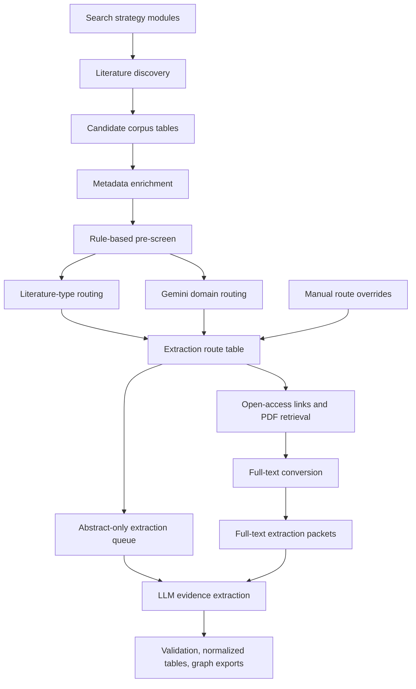

# Pipeline

This pipeline builds a reproducible literature corpus for the psychedelics
knowledge graph, screens papers for relevance, retrieves available full text,
and prepares clean inputs for structured evidence extraction.

This README is the living operational map for the current pipeline. When a
step changes, update this file first, then update the narrower stage README if
the change affects a specific script family.

The pipeline should be described by its actions, not by historical run labels.
Run labels such as `boolean_full_v1` or `pairwise_direct_v1` are provenance
labels for specific searches, not pipeline stages.

## Current Workflow



1. **Search planning** defines grouped domain searches and targeted direct-pair
   searches from the current compound, intervention, clinical, molecular,
   brain-system, cognitive-behavioral, safety, pharmacology, intervention, and
   public-health vocabularies.
2. **Literature discovery** queries the selected literature sources and stores
   source/run provenance for every retrieved DOI. Duplicate DOIs are deduplicated
   at the corpus level, but their search-source provenance is retained.
3. **Corpus table build** normalizes discovered records into the table-native
   corpus under `data/processed/corpus/`, especially `candidate_papers.parquet`,
   `candidate_contexts.parquet`, and `candidate_sources.parquet`.
4. **Metadata enrichment** adds titles, abstracts, publication metadata,
   publication-type labels, identifiers, open-access status, and PDF URL
   candidates. Provider roles are explicit: bibliographic metadata and
   abstracts, PubMed publication types, and open-access/PDF-link discovery are
   refreshed as separate passes.
5. **Rule-based pre-screening** removes only records that clearly lack usable
   title/abstract evidence or clearly fall outside the project scope. It writes
   decisions to `paper_prescreen_decisions.parquet` and can be rerun for the
   whole corpus or a DOI subset.
6. **Literature-type routing** separates primary or unclear empirical papers,
   secondary literature, and non-primary publication types. Secondary literature
   is further labeled as review, systematic review, meta-analysis, scoping
   review, guideline, consensus statement, or related types when the metadata
   and title/abstract rules support it.
7. **Domain routing** uses Gemini on title, abstract, and minimal supporting
   metadata to assign evidence domains and to exclude records that remain out of
   scope after pre-screening.
8. **Extraction route assembly** combines pre-screen decisions, literature type,
   Gemini domain routing, converted full-text artifacts, valid PDFs in the
   canonical PDF store, PDF URLs, and narrow manual overrides into
   `paper_extraction_routes.parquet`. This table is the current extraction
   queue source.
9. **Full-text handling** refreshes open-access links, downloads available legal
   PDFs, and converts local PDFs into structured full-text artifacts. Records
   without usable full text remain eligible for the abstract-only extraction path
   when the route table marks them as extraction candidates.
10. **Evidence extraction** uses route-specific LLM prompts and schemas for
    primary studies, secondary literature, guideline/consensus records, and
    abstract-only records.
11. **Validation and publishing** checks extracted evidence against schemas and
    evidence-policy rules, normalizes graph tables, and exports public graph,
    bibliography, and methods-flow payloads.

Generated Parquet tables are rebuildable. Durable decisions should live in
tracked code, configuration, search strategy files, model prompts, or small
manual-review files such as `pipeline/extract/manual_extraction_route_overrides.json`.
CSV audit files are human-readable inspection artifacts unless a script
explicitly takes them as input.

## Main Commands

### Search Planning

Build the current search files from configured registries:

```bash
python pipeline/ingest/build_boolean_search_modules.py --dataset all --run-id search_2026_05
python pipeline/ingest/build_comprehensive_search_plan.py --dataset all --profile standard --run-id search_2026_05
```

The script names still contain some older implementation wording. In methods
text, describe these as **grouped search modules** and **direct pair searches**.
If `--run-id` is omitted, scripts write to the neutral
`data/raw/search_strategies/literature_search/` run directory.

### Literature Discovery

Run grouped search modules or direct pair-search files through
`discover_literature.py` or the batch runners in `pipeline/ingest/`.

Example:

```bash
python pipeline/ingest/discover_literature.py \
  --dataset mechanistic \
  --provider pubmed \
  --seed-file data/raw/search_strategies/search_2026_05/grouped_modules/mechanistic_grouped_pubmed_seeds.csv \
  --max-results-per-seed 500 \
  --max-results 0
```

### Corpus Table Build

```bash
python pipeline/validate/build_context_provenance_audit.py \
  --table-out-dir data/processed/corpus
```

This writes `candidate_papers.parquet`, `candidate_contexts.parquet`,
`candidate_sources.parquet`, and `candidate_corpus_manifest.parquet`.
Rediscovered papers are deduplicated by DOI at the paper level while keeping
their source/query provenance in the context and source tables.

### Metadata Enrichment

Run role-aware metadata enrichment on the corpus table:

```bash
python pipeline/ingest/run_standard_metadata_enrichment.py \
  --dataset all \
  --write-every 100 \
  --progress-every 100
```

This writes `paper_metadata_enrichment.parquet`. Core metadata and abstracts
are refreshed separately from PubMed publication types and open-access/PDF URL
candidates. The default provider roles are controlled in
`run_standard_metadata_enrichment.py`: core metadata uses
PubMed/PMC/OpenAlex/Crossref/Semantic Scholar fallbacks, publication types come
from PubMed, and open-access/PDF links use Unpaywall/OpenAlex/PMC.

Scope a small update with `--doi-file <doi_list>` rather than rerunning the
whole table.

### Rule-Based Pre-Screen

```bash
python pipeline/review/run_deterministic_prescreen.py \
  --run-id deterministic_prescreen_YYYY_MM_DD
```

This writes `paper_prescreen_decisions.parquet` and
`paper_prescreen_summary.parquet`. It excludes only clear title/abstract
no-signal records, unusable abstract artifacts, and records that are clearly
outside scope. Use `--doi-file <doi_list>` or repeated `--doi <doi>` for scoped
updates.

The older local LLM abstract-screening scripts remain in `pipeline/review/` for
audit and comparison, but they are not the current extraction gate.

### Literature Type Routing

```bash
python pipeline/review/run_literature_type_routing.py
```

This writes `paper_literature_type_routing.parquet`. The router combines
publication-type metadata with title/abstract rules to separate primary or
unclear empirical literature, secondary literature, and non-primary context.

### Gemini Domain Routing

Prepare batch requests:

```bash
python pipeline/review/build_gemini_domain_routing_batch_queue.py --prepare
```

Advance the queue one submitted part at a time:

```bash
python pipeline/review/advance_gemini_domain_routing_batch_queue.py
```

This writes `paper_domain_routing_gemini.parquet`,
`paper_domain_routing_gemini_summary.json`, and
`paper_domain_routing_gemini_counts.csv`.

### Extraction Routes

```bash
python pipeline/extract/build_extraction_routes.py \
  --domain-routing-table data/processed/corpus/paper_domain_routing_gemini.parquet
```

This writes `paper_extraction_routes.parquet`,
`paper_extraction_routes_summary.json`, and
`paper_extraction_routes_counts.csv`. The default build also applies
`pipeline/extract/manual_extraction_route_overrides.json`, which is reserved
for narrow DOI-level manual reviews of ambiguous route assignments.

Access tiers are intentionally operational:

- `full_text_available`: converted full-text artifact exists locally.
- `local_pdf_available`: valid PDF exists in `data/raw/papers/pdfs/`, but
  conversion is still needed.
- `pdf_download_url_available`: a metadata-derived PDF URL exists, but no valid local PDF
  or converted full text has been found yet.
- `abstract_only`: no local full text, local PDF, or PDF URL is currently
  available.

### Canonical PDF Store

The current pipeline stores active source PDFs in one canonical directory:

```text
data/raw/papers/pdfs/
```

The old `data/raw/papers/mechanistic/pdfs/` and
`data/raw/papers/disorder/pdfs/` folders are legacy scaffolding and should stay
empty for the table-native pipeline. Same-DOI alternate PDFs are preserved under
`data/raw/papers/pdf_conflicts/`; files with `.pdf` names that are not valid PDF
content are kept under `data/raw/papers/invalid/`.

To reconcile the file store and corpus table:

```bash
python pipeline/fulltext/migrate_pdf_store.py --mode move --apply --move-conflicts
```

Run without `--apply` for a dry run. The script updates
`candidate_papers.parquet` so `pdf_local_path`, `local_pdf_paths`, and
`local_pdf_count` reflect only the canonical PDF store.

### Open-Access Links And PDF Retrieval

Refresh PDF URL candidates for routed extraction candidates:

```bash
python pipeline/ingest/refresh_open_access_links.py \
  --routing-table data/processed/corpus/paper_extraction_routes.parquet \
  --only-missing-pdf-url \
  --provider-order unpaywall,openalex,pmc \
  --progress-every 100
```

Use the route table to keep PDF download attempts scoped to retained extraction
candidates and to avoid retrying known closed-access or already-downloaded
records.

### Full-Text Conversion

Local PDFs are converted into structured full-text artifacts before full-text
LLM extraction. The default backend is GROBID, which parses scholarly articles
into TEI XML so downstream packets can preserve sections, tables, figures,
references, and stable evidence locators.

```bash
python pipeline/fulltext/convert_pdfs.py \
  --dataset mechanistic \
  --doi-file <route-derived-doi-file> \
  --backend grobid \
  --only-missing-artifacts
```

### Extraction Packet Preparation

The extraction route table is the source of truth for the next extraction run.
Build route-specific full-text and abstract-only model inputs from
`paper_extraction_routes.parquet`.

```bash
python pipeline/fulltext/build_llm_evidence_packets.py \
  --dataset all \
  --doi-file <route-derived-full-text-doi-file> \
  --out-jsonl data/processed/extraction/fulltext_packets.jsonl \
  --report-json data/processed/extraction/fulltext_packets_report.json \
  --omit-section-text \
  --omit-candidate-contexts \
  --packet-profile lean_primary \
  --max-references 0
```

Route-specific packet builders should preserve the route fields from
`paper_extraction_routes.parquet`, including `source_family`, `source_type`,
`domain_route`, `access_tier`, `route_action`, `prompt_profile`, and
`schema_profile`.

### Evidence Extraction

Run extraction pilots before scaling a full batch:

```bash
python pipeline/extract/run_gemini_extraction_v1.py \
  --input-jsonl <route-specific-pilot-inputs.jsonl> \
  --out-jsonl data/processed/extraction/extraction_v1_outputs.jsonl \
  --raw-jsonl data/processed/extraction/extraction_v1_gemini_raw.jsonl \
  --report-json data/processed/extraction/extraction_v1_gemini_report.json
```

## Canonical Outputs

- `data/raw/doi_queue.<dataset>.discovered.txt`
- source/provider discovery reports under `data/raw/search_strategies/` and
  `data/processed/`
- `data/processed/corpus/candidate_papers.parquet`
- `data/processed/corpus/candidate_contexts.parquet`
- `data/processed/corpus/candidate_sources.parquet`
- `data/processed/corpus/paper_metadata_enrichment.parquet`
- `data/processed/corpus/paper_prescreen_decisions.parquet`
- `data/processed/corpus/paper_literature_type_routing.parquet`
- `data/processed/corpus/paper_domain_routing_gemini.parquet`
- `data/processed/corpus/paper_extraction_routes.parquet`
- `data/processed/fulltext/<dataset>/*.json`
- `data/processed/extraction/*_fulltext_packets.jsonl`
- `data/processed/extraction/extraction_v1_outputs*.jsonl`
- normalized graph and bibliography payloads under `data/kg/`,
  `data/processed/`, and `ui/`

## Run Labels

Use run labels to separate artifacts from different searches or batches:

- Good labels describe the run: `grouped_search_2026_05`,
  `direct_pairs_2026_05`, `monthly_update_2026_06`.
- Historical labels such as `boolean_full_v1`, `pairwise_direct_v1`, and
  `comprehensive_baseline_v1` are retained only so existing outputs remain
  reproducible.
- Do not use run labels as public method names.

## Corpus Tables

`data/processed/corpus/` contains the current table-based corpus. Downstream
steps should query these tables instead of large JSON snapshots.

The raw run reports remain append-only provenance. The files under
`data/processed/extraction/` are current views regenerated from corpus tables
and full-text artifacts.

Current corpus storage direction: use normalized Parquet tables for papers,
contexts, source/provenance events, and metadata enrichment. Later, load those
normalized tables into Postgres for website search, API queries, and MCP-facing
paper/KG access.

Build the current normalized candidate corpus tables:

```bash
python pipeline/validate/build_context_provenance_audit.py \
  --table-out-dir data/processed/corpus
```

This writes `candidate_papers.parquet`, `candidate_contexts.parquet`,
`candidate_sources.parquet`, and `candidate_corpus_manifest.parquet`.

## Local Config

Keep credentials in the ignored local config:

```bash
cp pipeline/config.local.example.yaml pipeline/config.local.yaml
chmod 600 pipeline/config.local.yaml
```

Common settings:

- `openalex.api_key`
- `pubmed.email`
- `pubmed.api_key`
- `crossref.email`
- `unpaywall.email`
- `semantic_scholar.api_key`

Scripts that use `pipeline/config.example.yaml` automatically overlay
`pipeline/config.local.yaml` when it exists.

## Legacy Maintenance Path

The first-generation graph used context-level stubs, autofill scripts, and
promotion into curated evidence-record files. Those tools remain under
`pipeline/review/` and `pipeline/extract/promote_ready_stubs.py` for maintenance
and comparison, but new KG evidence should flow through the route table and
route-specific extraction packets first.
