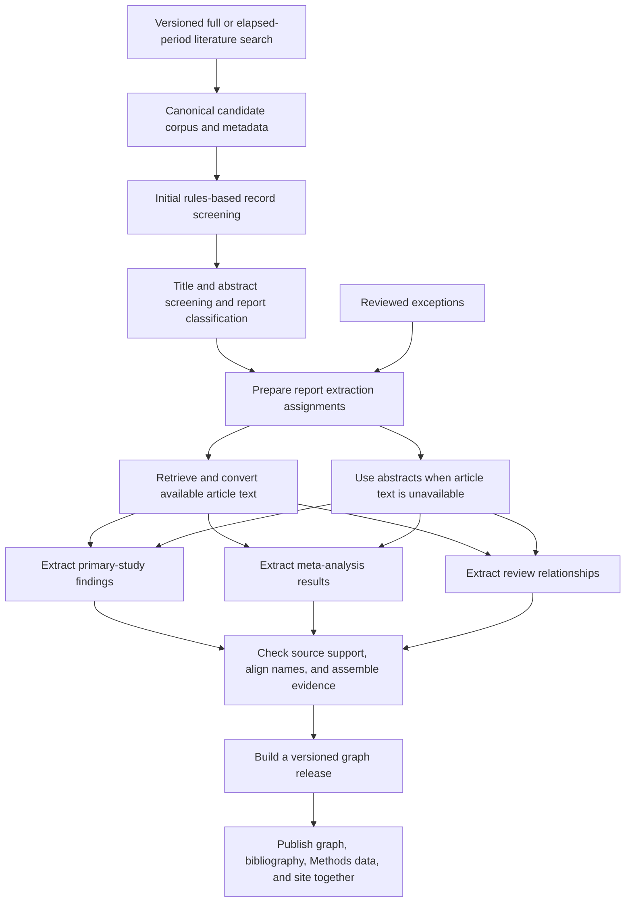

# Pipeline

This pipeline builds and maintains the evidence base behind the Psychedelics
Knowledge Graph. It discovers literature into the canonical candidate corpus,
screens records for relevance, prepares the best available report text,
extracts structured findings, and publishes reviewed releases of the graph,
record audit, and Methods page.

This README is the living operational map for the current pipeline. When a
step changes, update this file first, then update the narrower stage README if
the change affects a specific script family.

## Current Workflow



1. **Living literature discovery** runs versioned PubMed and OpenAlex searches
   either over the elapsed period or over the full historical period. It counts
   before retrieval, partitions large results by date, resumes across provider
   budgets, preserves provider IDs and query provenance, reports query yield,
   and refuses to promote mechanically incomplete runs. Known-record coverage
   is optional rather than a recall claim or default promotion gate. Graph entity
   allowlists are not expanded into a provider-side Cartesian query grid. See
   `pipeline/discovery/README.md`.
2. **Canonical corpus and metadata enrichment** starts from
   `candidate_papers.parquet` and adds titles, abstracts, publication metadata,
   publication-type labels, identifiers, open-access status, and PDF URL
   candidates. Provider roles are explicit: bibliographic metadata and
   abstracts, PubMed publication types, and open-access/PDF-link discovery are
   refreshed as separate passes. A resumable abstract-quality repair pass
   rejects reconstructed full text, publisher-page text, and multi-record
   containers; it recovers a clean provider abstract where possible and blanks
   unresolved contaminated fields before screening.
3. **Initial screening** removes only records that clearly fall outside the
   project scope or are non-evidence artifacts. After metadata enrichment,
   records without usable abstracts receive the auditable reason
   `exclude_no_usable_abstract`; title-only records are not sent to model
   screening. It writes
   decisions to `paper_prescreen_decisions.parquet` and can be rerun for the
   whole corpus or a DOI subset. It does not assign evidence-domain routes.
4. **Title and abstract screening and classification** assesses retained records
   for relevance, evidence topics, and report type. Primary studies,
   meta-analyses, other reviews, and non-primary context remain distinguishable
   throughout extraction and publication. The current implementation uses a
   structured model-assisted pass, with exact technical details recorded in the
   generated corpus fields and run artifacts. Its screening decision is binary:
   plausible relevance is included to preserve recall, while only clearly
   out-of-scope records are excluded. Validated abstracts are supplied in full.
5. **Extraction preparation** combines the screening decisions, report type,
   evidence topics, available source text, and narrowly reviewed exceptions in
   `paper_extraction_routes.parquet`. Despite the filename, this is best
   described publicly as the set of extraction assignments for each report.
6. **Source-text preparation** refreshes open-access links, downloads available legal
   PDFs, retrieves reusable PMC XML when available, and converts local full-text
   sources into structured artifacts. Records without usable full text remain
   eligible for abstract-only extraction when they otherwise meet the selection
   criteria.
7. **Structured evidence extraction** uses different report-centered contracts
   for primary studies, meta-analyses, and other reviews. Primary-study results,
   pooled estimates, and review-level relationships are not flattened into one
   evidence type. Guidelines, context-only records, and other non-extraction
   records remain available for corpus accounting without becoming findings.
8. **Validation and graph preparation** checks extracted information against
   its source, preserves source locations, uses consistent names for compounds
   and related topics, and writes one final graph-inclusion decision, reason,
   and provenance record back to `candidate_papers.parquet` for every DOI.
9. **Staging and publication** builds versioned graph tables, author data, and
   compact browser files. A guarded promotion first materializes and validates
   the release's final decisions in the canonical corpus ledger, then generates
   the bibliography and PRISMA flow from that ledger alone. It updates the
   ledger, active evidence release, graph, Methods outputs, and static site as
   one atomic unit.

Derived Parquet tables are rebuildable. Durable decisions should live in
tracked code, configuration, model prompts, or small
manual-review files such as `pipeline/extract/manual_extraction_route_overrides.json`
and `pipeline/fulltext/manual_fulltext_access_overrides.json`. Curated screening
decisions in `data/curated/screening_decision_overrides.json` are applied before
extraction. Final post-extraction exceptions may be staged in
`data/curated/graph_inclusion_disposition_overrides.json`, but public outputs do
not read that file directly; promotion writes the resolved decision into the
canonical corpus first.
CSV audit files are human-readable inspection artifacts unless a script
explicitly takes them as input.

## Main Commands

### Updating one report or a DOI list

Do not rerun all model extraction or edit KG rows directly for a correction.
Use the three-phase scoped updater:

```bash
python pipeline/update/run_scoped_paper_update.py prepare \
  --update-id paper_fix_YYYYMMDD \
  --doi-file path/to/update_dois.txt \
  --refresh-derived

# Run only the generated ready_tasks*.jsonl files through extraction.

python pipeline/update/run_scoped_paper_update.py finalize \
  --update-id paper_fix_YYYYMMDD \
  --patch-outputs path/to/scoped_route_extraction_outputs.jsonl

python pipeline/update/run_scoped_paper_update.py promote \
  --update-id paper_fix_YYYYMMDD
```

Preparation and finalization do not change the active KG. Finalization removes
all previous output/evidence rows for the DOI scope and refuses incomplete or
stale replacements. See
[`docs/scoped_paper_updates.md`](../docs/scoped_paper_updates.md) for batch API
commands, exclusion-only updates, audits, and rollback behavior.

### Literature Discovery And Corpus Updates

Plan or run an elapsed-period update:

```bash
python pipeline/discovery/run_literature_search.py \
  --mode update \
  --run-id living_update_v3_YYYYMMDD \
  --config pipeline/config.local.yaml \
  --scope-config pipeline/config.example.yaml \
  --layers core,scope
```

Resume paused runs with `--resume --run-id ...`. Promote only after the run's
completion gate passes:

```bash
python pipeline/discovery/promote_search_run.py \
  --run-id living_update_v3_YYYYMMDD
```

See [`pipeline/discovery/README.md`](discovery/README.md) for full reruns,
request budgets, scope-delta recovery, artifacts, and downstream handoff.

### Metadata Enrichment

For a large promoted discovery run, recover abstracts through resumable batch
endpoints before deterministic pre-screening:

```bash
python pipeline/ingest/run_batch_abstract_enrichment.py \
  --run-id batch_abstract_enrichment_YYYYMMDD \
  --doi-file data/processed/discovery/runs/<discovery_run_id>/new_candidate_dois.txt
```

This queries PMC in identifier batches and Semantic Scholar in DOI batches,
checkpoints every completed batch, preserves existing abstracts, and backs up
the metadata table before merging. A subsequent residual-only Crossref stage
can be run with a new run ID and `--providers crossref`; it uses the configured
polite-pool rate, no more than three workers, and resumable checkpoints. The
pipeline intentionally defers open-access/PDF lookups until after screening so
those calls are spent on retained records.

For small updates or per-record fallback enrichment, run the role-aware
metadata sequence:

```bash
python pipeline/ingest/run_standard_metadata_enrichment.py \
  --write-every 100 \
  --progress-every 100
```

This writes `paper_metadata_enrichment.parquet`. Core metadata and abstracts
are refreshed separately from PubMed publication types and open-access/PDF URL
candidates. The default provider roles are controlled in
`run_standard_metadata_enrichment.py`: core metadata uses
PubMed/PMC/OpenAlex/Crossref/Semantic Scholar fallbacks, publication types come
from PubMed, and open-access/PDF links use Unpaywall/OpenAlex/PMC.

Scope it with `--doi-file <doi_list>` rather than rerunning the whole table.
See [`pipeline/ingest/README.md`](ingest/README.md) for batch run artifacts,
dry-run and retrieval-only modes, and resume behavior.

### Rule-Based Pre-Screen

```bash
python pipeline/review/run_deterministic_prescreen.py \
  --run-id deterministic_prescreen_YYYY_MM_DD
```

This writes `paper_prescreen_decisions.parquet` and
`paper_prescreen_summary.parquet`. It excludes clear non-evidence artifacts and
records that are clearly outside scope. Missing or unusable abstracts receive a
uniform `exclude_no_usable_abstract` decision; title-only records are not sent
to LLM screening. Abstract-only records are screened normally. This stage does
not generate domain-routing tags; those belong to the LLM screening stage. The
validated decisions are written into `candidate_papers.parquet`, and the shared
stage-aware decision reconciler clears superseded downstream active state while
preserving metadata, source artifacts, and historical run provenance. Use
`--doi-file <doi_list>` or repeated `--doi <doi>` for scoped updates.

### Gemini Domain Routing

Prepare batch requests:

```bash
python pipeline/review/build_gemini_domain_routing_batch_queue.py \
  --previous-candidate-table path/to/pre-promotion-candidate_papers.parquet \
  --prepare
```

Advance the queue one submitted part at a time:

```bash
python pipeline/review/advance_gemini_domain_routing_batch_queue.py --submit
```

Without `--submit`, the queue-advance command is inspection-only and cannot
submit pending jobs.

This writes `paper_domain_routing_gemini.parquet`,
`paper_domain_routing_gemini_summary.json`, and
`paper_domain_routing_gemini_counts.csv`. The Gemini response includes
`screening_decision`, `domain_tags`, `primary_domain`, `paper_type_group`, and
`paper_type`; this table is the source of report type for new extraction routes.

### Post-screen Full-text Worklist

Build the new/unprocessed DOI selection directly from screening state before
any extraction routes exist:

```bash
python pipeline/fulltext/build_fulltext_enrichment_worklist.py
```

This is the standard incremental handoff after screening. It applies
report-level and non-primary/context-only eligibility decisions, subtracts the
prior processed ledger and active graph, and writes a selected DOI list, the
subset still needing full-text enrichment, a one-row-per-DOI worklist with the
next full-text action, and a provenance report. It does not construct topic
routes, prompts, schemas, extraction tasks, or model jobs.

PMC retrieval, PDF retrieval, and conversion consume this worklist directly.
Use explicit versioned output paths when retaining multiple update runs.

### Extraction Routes (after Full-text Enrichment)

```bash
python pipeline/extract/build_extraction_routes.py \
  --domain-routing-table data/processed/corpus/paper_domain_routing_gemini.parquet
```

This writes `paper_extraction_routes.parquet`,
`paper_extraction_routes_summary.json`, and
`paper_extraction_routes_counts.csv`. Preprint and unpublished posted-content
records are excluded before routing by deterministic pre-screening, and the
route build treats the pre-screen table as authoritative. The build also
applies two narrow DOI-level manual review files:

- `pipeline/extract/manual_extraction_route_overrides.json` for route/domain
  decisions such as context-only, conference abstracts, corrections, or
  non-article records.
- `pipeline/fulltext/manual_fulltext_access_overrides.json` for access
  decisions such as suppressing a misleading probable-PDF URL after manual
  review confirms there is no usable open article PDF.
- `data/curated/screening_decision_overrides.json` for reviewed report-level
  exclusions that must prevent extraction tasks.

The canonical route table is built across the full corpus after full-text work
so current decisions and access states remain reproducible. Rebuilding it is
deterministic and does not itself download PDFs, convert files, build model
tasks, or submit model jobs. Incremental task construction scopes the canonical
table with `postscreen_selected_dois.txt`, so existing papers are not
resubmitted.

The build also updates `candidate_papers.parquet` as the DOI-level pipeline
ledger. It backfills publication-stage fields, pre-screen summaries, Gemini
report-type/domain summaries, extraction-route status, route counts, prompt and
schema profiles, manual full-text access decisions, and the best available text
tier. Promotion then adds the final graph status, disposition, reason, decision
source, run ID, and release ID. The detailed many-row route assignments stay in
`paper_extraction_routes.parquet`; `candidate_papers.parquet` keeps one row per
DOI and is the sole input for the public PRISMA flow and complete bibliography.
The Methods build fails when this ledger is missing a decision or contains a
contradictory screening, extraction-selection, or graph status.

Access tiers are intentionally operational:

- `full_text_available`: converted full-text artifact exists locally.
- `local_pdf_available`: valid PDF exists in `data/raw/papers/pdfs/`, but
  conversion is still needed.
- `pdf_download_url_available`: a metadata-derived URL looks like a direct PDF
  endpoint, but no valid local PDF or converted full text has been found yet.
- `abstract_only`: no local full text, local PDF, or probable PDF download URL is
  currently available. Weaker landing-page or repository URLs are still kept in
  the corpus table for manual access checks.

### Canonical PDF Store

The current pipeline stores active source PDFs in one canonical directory:

```text
data/raw/papers/pdfs/
```

Same-DOI alternate PDFs are preserved under `data/raw/papers/pdf_conflicts/`;
files with `.pdf` names that are not valid PDF content are kept under
`data/raw/papers/invalid/`.

PDF retrieval and manual import write directly to the canonical store and keep
`candidate_papers.parquet` synchronized. Historical dataset-specific PDF
directories are retired and should not be recreated.

### Open-Access Links And PDF Retrieval

Refresh PDF URL candidates for the post-screen full-text worklist:

```bash
python pipeline/ingest/refresh_open_access_links.py \
  --doi-file data/processed/corpus/fulltext_enrichment_dois.txt \
  --only-missing-pdf-url \
  --provider-order unpaywall,openalex,pmc \
  --progress-every 100
```

Use the full-text worklist to keep attempts scoped to newly selected,
unprocessed records and to avoid retrying existing corpus papers.

Run PMC recovery first, then PDF retrieval directly from the worklist:

```bash
python pipeline/fulltext/fetch_pmc_fulltext_xml.py \
  --selection-table data/processed/corpus/fulltext_enrichment_worklist.parquet

python pipeline/fulltext/download_fulltext_worklist_pdfs.py \
  --progress-every 25 \
  --write-every 25
```

These steps use only the selected full-text actions, write successful downloads
to `data/raw/papers/pdfs/`, and update `candidate_papers.parquet`. They do not
build extraction routes in selection-table mode. Use `--dry-run` to inspect the
queue before network calls and `--limit <N>` for a pilot. The downloader logs
each DOI and candidate-URL attempt/result by default. For
quieter supervised runs, set `--attempt-log-every <N>`,
`--candidate-log-every <N>`, or use `0` for either option; use
`--progress-every <N>` for aggregate progress summaries.
The route builder and downloader distinguish probable PDF endpoints from weaker
landing-page or repository links. Automated downloads use probable PDF URLs by
default; weaker links stay visible as `other_url_candidates` for refreshed link
discovery or manual download. Use `--include-weak-pdf-urls` only for diagnostic
or manually supervised recovery runs.

By default, the downloader interleaves queued reports by primary PDF host instead
of processing table order. This avoids sending long consecutive runs of requests
to one repository or publisher, which reduces avoidable rate limiting while
still keeping all reports in the same first-pass retrieval stage. If a host
returns a temporary failure such as a rate-limit response, timeout, or 5xx
provider error, only that host is cooled down; alternative PDF candidate URLs
for the same DOI can still be tried. Use `--preserve-task-order` only for
diagnostics where deterministic table order is required.
The downloader records `pdf_download_failure_category`,
`pdf_download_failure_categories`, `pdf_download_error`, and
`pdf_download_retry_recommended` in `candidate_papers.parquet`. Retry only
temporary categories such as `rate_limited`, `provider_error`, and `timeout`;
do not repeatedly retry `forbidden`, `not_found`, `non_pdf_response`, or
`weak_pdf_url_only` unless new PDF URLs have been refreshed.

For low-level debugging, the direct downloader and repository-recovery steps can
still be run separately:

```bash
python pipeline/fulltext/download_routed_pdfs.py \
  --limit 25 \
  --alternate-pdf-sources pmc,openalex,semantic_scholar
python pipeline/fulltext/recover_pdf_landing_pages.py \
  --standard-recovery-only \
  --categories forbidden,non_pdf_response,provider_error,timeout,other_download_failure,not_found
python pipeline/fulltext/export_manual_pdf_queue.py
```

For explicit post-direct cleanup of publisher landing pages known to expose
downloadable same-host PDFs, use a named rescue preset instead of making broad
host probing the default retrieval path:

```bash
python pipeline/fulltext/recover_pdf_landing_pages.py \
  --rescue-preset akjournals \
  --apply \
  --rebuild-routes-after
python pipeline/fulltext/export_manual_pdf_queue.py
python pipeline/fulltext/rank_manual_pdf_queue.py
```

For normal-browser click-through recovery, configure Chrome or the save dialog
to write into `data/raw/papers/manual_pdf_inbox/` rather than the general
Downloads folder. Treat article pages as a click-through ladder: first open
controls such as "Article", "Full text", "View article", or "Read article" when
the PDF button is not yet visible, then look for "PDF", "Download PDF", "View
PDF", or the browser PDF-viewer download control. Before importing, triage the
browser output so HTML paywall, cookie, and other non-PDF saves are classified
and moved out of the inbox:

```bash
python pipeline/fulltext/browser_download_triage.py \
  --download-dir data/raw/papers/manual_pdf_inbox \
  --quarantine-non-pdf \
  --apply
python pipeline/fulltext/import_manual_pdfs.py \
  --inbox-dir data/raw/papers/manual_pdf_inbox \
  --apply \
  --move
```

If a manually inspected inbox PDF is known to replace an incorrect canonical
PDF for the same DOI, add `--replace-existing`; the prior canonical file is
backed up under `data/raw/papers/pdf_conflicts/` before replacement.

Visible browser states such as "Get access", "Log in", or "you do not have
access" should be recorded as `no_access_or_paywalled` instead of retried as
PDF downloads.

After importing manual PDFs or adding access/route overrides, rebuild routes,
convert any newly local PDFs, and refresh the manual queue exports:

```bash
python pipeline/extract/build_extraction_routes.py
python pipeline/fulltext/run_local_pdf_conversion_pipeline.py --batch-size 25
python pipeline/fulltext/export_manual_pdf_queue.py
python pipeline/fulltext/rank_manual_pdf_queue.py
```

When manual review confirms that a remaining DOI has no usable open article
PDF, add `manual_access_action=suppress_pdf_download` in
`pipeline/fulltext/manual_fulltext_access_overrides.json` and rebuild routes.
When manual review confirms a record is not an extractable article, add
`manual_action=context_only` in
`pipeline/extract/manual_extraction_route_overrides.json` and rebuild routes.

Example recovery pass:

```bash
python pipeline/fulltext/download_routed_pdfs.py \
  --only-failure-categories rate_limited,provider_error,timeout \
  --skip-candidate-statuses downloaded,already_present,manual_import \
  --rate-limit-cooldown-sec 30 \
  --timeout-sec 45 \
  --max-retries 1
```

### Full-Text Conversion

For retained reports with a PMCID but no converted full text and no local PDF,
retrieve reusable PMC XML before treating the record as abstract-only:

```bash
python pipeline/fulltext/fetch_pmc_fulltext_xml.py \
  --progress-every 25 \
  --rps 1.5
```

The script tries the Europe PMC XML endpoint first and then PMC OAI/JATS. It
writes successful XML into the canonical article-text store,
`data/processed/fulltext/articles/`, using the same artifact shape as PDF
conversion. After a real run writes artifacts, it rebuilds
`paper_extraction_routes.parquet` automatically, so successful XML records move
to `full_text_available` and are not kept in the PDF-download queue.

Local PDFs are converted into structured full-text artifacts before article-text
LLM extraction. The default backend is GROBID, which parses scholarly articles
into TEI XML so downstream model inputs can preserve sections, tables, figures,
references, and stable evidence locators.

```bash
python pipeline/fulltext/convert_routed_local_pdfs.py \
  --backend grobid
```

`paper_extraction_routes.parquet` reads converted article text only from
`data/processed/fulltext/articles/<doi_slug>.json`. The retired split
directories no longer exist and route building does not use fallback artifact
stores.

### Article Text Input Preparation

The extraction route table is the source of truth for the next extraction run.
Build route-specific article text inputs from `paper_extraction_routes.parquet`
and the canonical `fulltext/articles/` artifacts:

```bash
python pipeline/fulltext/build_article_text_inputs.py
```

The default section policy keeps primary studies focused on methods/results and
uses all extracted sections for meta-analyses and reviews.

Then build route-specific task records. These records preserve `route_id` as the
stable extraction-job key, because one DOI can have multiple domain-specific
extraction routes.

```bash
python pipeline/extract/build_extraction_tasks.py
```

Before model calls, audit selected article text from the canonical
`fulltext/articles/` store:

```bash
python pipeline/fulltext/audit_article_text_inputs.py \
  --per-strategy 3
```

Route-specific article text builders should use `fulltext_artifact_paths` from
`paper_extraction_routes.parquet` and preserve fields such as
`source_family`, `source_type`, `domain_route`, `access_tier`, `route_action`,
`prompt_profile`, and `schema_profile`. In public explanations, call these
extraction assignments and article text inputs.

Primary-study extraction uses topic-specific tasks built from the extraction
assignments. Meta-analyses and other reviews now use report-centered extraction
paths so a synthesis is interpreted as a whole report rather than as unrelated
topic fragments. The detailed commands and current contracts are documented in
[`pipeline/extract/README.md`](extract/README.md).

Guideline, context-only, and no-extraction assignments are retained for audit
and corpus accounting but are not sent for evidence extraction.

Not every selected report becomes a graph finding. Primary studies,
meta-analyses, and other reviews can each produce candidate findings, but they
remain separate source views and still have to pass validation and
normalization. Guidelines, context-only records, and no-extraction assignments
are retained for corpus accounting rather than graph relationships.

Inspect registered primary-study tasks without model calls:

```bash
python pipeline/extract/run_route_extraction.py \
  --schema-profile primary_evidence_schema \
  --dry-run
```

### Evidence Extraction

Primary studies use topic-specific extraction tasks. Build and run those tasks,
then convert successful results into the shared evidence-row format:

```bash
python pipeline/extract/build_extraction_tasks.py
python pipeline/extract/run_route_extraction.py \
  --input-jsonl data/processed/extraction/route_extraction_tasks.jsonl
python pipeline/kg/convert_routed_extractions_to_evidence_rows.py \
  --use-default-active-route-table
```

Meta-analyses use `build_meta_analysis_v2_tasks.py`,
`run_meta_analysis_v2_batch_api.py`, and
`convert_meta_analysis_v2_to_evidence_rows.py`. Other reviews use
`build_review_relationship_tasks.py`, the review relationship runner, and
`convert_review_relationship_bundles_to_evidence_rows.py`. These paths preserve
pooled estimates and review-level relationships separately from primary-study
findings.

Before building a graph release, assemble the complete accepted primary,
meta-analysis, and review layers into one explicit evidence snapshot. Do not let
a small retry or correction replace an unaffected evidence family. Then build a
versioned release without activating it:

```bash
scripts/build_routed_kg_payload.sh "$RUN_ID"
```

After review, publish the already-built release with the guarded promoter:

```bash
python pipeline/publish/promote_routed_run.py --run-id "$RUN_ID"
```

Promotion stages the release's final decisions into `candidate_papers.parquet`,
validates the complete ledger, generates the Methods selection flow and full
bibliography only from that staged ledger, and then refreshes the corpus, active
graph pointers, Methods outputs, and `dist/` site bundle together. For
corrections to selected reports, use the scoped updater described at the start
of this guide; it applies the same publication safeguards.

## Canonical Outputs

- `data/processed/corpus/candidate_papers.parquet`
- `data/processed/corpus/candidate_contexts.parquet`
- `data/processed/corpus/candidate_sources.parquet`
- `data/processed/corpus/paper_metadata_enrichment.parquet`
- `data/processed/corpus/paper_prescreen_decisions.parquet`
- `data/processed/corpus/paper_domain_routing_gemini.parquet`
- `data/processed/corpus/paper_extraction_routes.parquet`
- `data/processed/fulltext/articles/*.json`
- article text inputs under `data/processed/extraction/`
- versioned extraction outputs and assembled evidence snapshots under
  `data/processed/extraction/`
- checked graph releases under `data/processed/kg_routed_runs/<RUN_ID>/`
- compact graph and detail files under
  `data/processed/graph_payload_runs/<RUN_ID>/`
- the active extraction and public-graph release records at
  `data/processed/extraction/active_routed_run.json` and
  `data/processed/graph_payload_active.json`
- generated Methods flow and bibliography files under `data/kg/views/`
- the deployable public site under `dist/`

## Run Labels

Use run labels to separate artifacts from different update or extraction batches:

- Good labels describe the run: `monthly_update_2026_06` or
  `paper_fix_2026_07_14`.
- Do not use run labels as public method names.

## Corpus Tables

`data/processed/corpus/` contains the current table-based corpus. Downstream
steps should query these tables instead of large JSON snapshots.

Run reports remain append-only provenance. The files under
`data/processed/extraction/` are current views regenerated from corpus tables
and full-text artifacts.

Current corpus storage direction: use structured Parquet tables for records,
contexts, source/provenance events, and metadata enrichment. Later, load those
tables into Postgres for website search, API queries, and MCP-facing
record, report, and KG access.

`candidate_papers.parquet` is the canonical corpus input. Historical
dataset-specific acquisition builders are not part of the operational pipeline.

## Local Config

Keep credentials in the ignored local config:

```bash
cp pipeline/config.local.example.yaml pipeline/config.local.yaml
chmod 600 pipeline/config.local.yaml
```

Common settings:

- `openalex.api_key`
- `pubmed.email`
- `pubmed.api_key`
- `crossref.email`
- `unpaywall.email`
- `semantic_scholar.api_key`

Scripts that use `pipeline/config.example.yaml` automatically overlay
`pipeline/config.local.yaml` when it exists.
