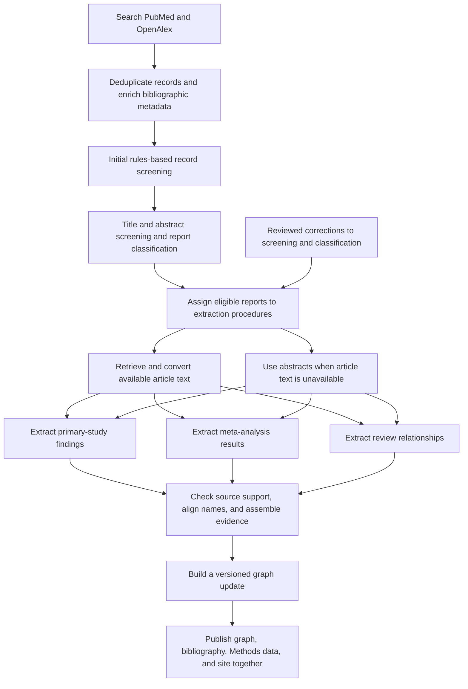

# Evidence Synthesis Pipeline

This pipeline builds and maintains the evidence base behind Psychedelics
Knowledge Graph. It searches the literature, consolidates bibliographic records,
screens records for eligibility, prepares the best available report text,
extracts structured findings, validates them against their sources, and
publishes reviewed updates to the graph, bibliography, and Methods page.

This guide describes the complete workflow and provides the main commands used
to operate it. More detailed instructions are available in the README for each
pipeline stage.

## Current workflow



1. **Literature search** runs reproducible PubMed and OpenAlex searches for a
   defined update period or across all publication years. The pipeline records
   each query, retrieves every available result page, divides large result sets
   by date when necessary, and resumes interrupted requests. See
   [`pipeline/discovery/README.md`](discovery/README.md).
2. **Record consolidation and metadata enrichment** deduplicates search results
   and adds titles, abstracts, publication details, publication types,
   identifiers, open-access status, and candidate PDF links. Abstracts are
   checked for validity before screening.
3. **Initial screening** applies rules-based criteria to remove non-research
   material, clearly out-of-scope records, and records without a usable
   abstract. Decisions and exclusion reasons are recorded in
   `paper_prescreen_decisions.parquet`.
4. **Title and abstract screening** uses Gemini 3 Flash Preview to assess relevance,
   assign evidence topics, and classify each report as a primary study,
   meta-analysis, other review, or contextual record. The screening procedure
   prioritizes sensitivity by retaining records with plausible relevance for
   later assessment.
5. **Extraction assignment** combines screening decisions, report type,
   evidence topics, available source text, and reviewed corrections to determine
   how each eligible report will be processed. Assignments are stored in
   `paper_extraction_routes.parquet`.
6. **Full-text preparation** retrieves reusable PMC XML and legally accessible
   PDFs, then converts them into structured article content. Eligible reports
   proceed with abstract-only extraction when full text cannot be obtained.
7. **Structured evidence extraction** uses Gemini 3 Flash Preview with separate
   procedures for primary studies, meta-analyses, and other reviews. This
   preserves the distinctions among individual study results, pooled estimates,
   and review-level conclusions.
8. **Validation and graph preparation** checks extracted findings against their
   source reports, retains source locations, standardizes terminology, and
   records the final graph-inclusion decision for each report.
9. **Review and publication** builds a versioned graph update and validates its
   report-level decisions. Publication updates the evidence release, graph,
   bibliography, PRISMA flow diagram, Methods data, and static site together.

## Main commands

The sections below form the technical runbook for maintaining and updating the
evidence base. The workflow overview above provides the methodological summary.

### Updating one report or a DOI list

Do not rerun all model extraction or edit KG rows directly for a correction.
Use the three-phase scoped updater:

```bash
python pipeline/update/run_scoped_paper_update.py prepare \
  --update-id paper_fix_YYYYMMDD \
  --doi-file path/to/update_dois.txt \
  --refresh-derived

# Run only the generated ready_tasks*.jsonl files through extraction.

python pipeline/update/run_scoped_paper_update.py finalize \
  --update-id paper_fix_YYYYMMDD \
  --patch-outputs path/to/scoped_route_extraction_outputs.jsonl

python pipeline/update/run_scoped_paper_update.py promote \
  --update-id paper_fix_YYYYMMDD
```

The active graph changes only during the publication phase. Finalization
replaces previous extraction outputs for the selected DOIs and requires a
complete, current set of replacement outputs. See
[`docs/scoped_paper_updates.md`](../docs/scoped_paper_updates.md) for batch API
commands, exclusion-only updates, audits, and rollback behavior.

### Literature discovery and record updates

Plan or run an elapsed-period update:

```bash
python pipeline/discovery/run_literature_search.py \
  --mode update \
  --run-id living_update_v3_YYYYMMDD \
  --config pipeline/config.local.yaml \
  --scope-config pipeline/config.example.yaml \
  --layers core,scope
```

Resume paused runs with `--resume --run-id ...`. After retrieval and record-count
checks pass, add the search results to the consolidated record set:

```bash
python pipeline/discovery/promote_search_run.py \
  --run-id living_update_v3_YYYYMMDD
```

See [`pipeline/discovery/README.md`](discovery/README.md) for full reruns,
request budgets, scope-delta recovery, artifacts, and downstream handoff.

### Metadata enrichment

For a large completed search run, recover abstracts through resumable batch
endpoints before initial screening:

```bash
python pipeline/ingest/run_batch_abstract_enrichment.py \
  --run-id batch_abstract_enrichment_YYYYMMDD \
  --doi-file data/processed/discovery/runs/<discovery_run_id>/new_candidate_dois.txt
```

This queries PMC in identifier batches and Semantic Scholar in DOI batches,
checkpoints every completed batch, preserves existing abstracts, and backs up
the metadata table before merging. A subsequent residual-only Crossref stage
can be run with a new run ID and `--providers crossref`; it uses the configured
polite-pool rate, no more than three workers, and resumable checkpoints.
Open-access and PDF-link searches occur after screening so retrieval requests
focus on eligible records.

For small updates or per-record fallback enrichment, run the role-aware
metadata sequence:

```bash
python pipeline/ingest/run_standard_metadata_enrichment.py \
  --write-every 100 \
  --progress-every 100
```

This writes `paper_metadata_enrichment.parquet`. Core metadata and abstracts
are refreshed separately from PubMed publication types and open-access/PDF URL
candidates. The default source selection is controlled in
`run_standard_metadata_enrichment.py`: core metadata uses
PubMed/PMC/OpenAlex/Crossref/Semantic Scholar fallbacks, publication types come
from PubMed, and open-access/PDF links use Unpaywall/OpenAlex/PMC.

Use `--doi-file <doi_list>` to limit enrichment to a specified DOI set.
See [`pipeline/ingest/README.md`](ingest/README.md) for batch run artifacts,
dry-run and retrieval-only modes, and resume behavior.

### Rules-based initial screening

```bash
python pipeline/review/run_deterministic_prescreen.py \
  --run-id deterministic_prescreen_YYYY_MM_DD
```

This writes `paper_prescreen_decisions.parquet` and
`paper_prescreen_summary.parquet`. It excludes clear non-evidence artifacts and
records that are clearly outside scope. Missing or unusable abstracts receive a
uniform `exclude_no_usable_abstract` decision. Records with usable abstracts
proceed to LLM screening, where evidence topics are assigned. The
validated decisions are written into `candidate_papers.parquet`, and the shared
stage-aware decision reconciler clears superseded downstream active state while
preserving metadata, source artifacts, and historical run provenance. Use
`--doi-file <doi_list>` or repeated `--doi <doi>` for scoped updates.

### LLM-based title and abstract screening

Prepare batch requests:

```bash
python pipeline/review/build_gemini_domain_routing_batch_queue.py \
  --previous-candidate-table path/to/pre-promotion-candidate_papers.parquet \
  --prepare
```

Advance the queue one submitted part at a time:

```bash
python pipeline/review/advance_gemini_domain_routing_batch_queue.py --submit
```

Omit `--submit` to inspect the queue without sending pending jobs.

This writes `paper_domain_routing_gemini.parquet`,
`paper_domain_routing_gemini_summary.json`, and
`paper_domain_routing_gemini_counts.csv`. The Gemini response includes
`screening_decision`, `domain_tags`, `primary_domain`, `paper_type_group`, and
`paper_type`; this table is the source of report type for new extraction routes.

### Full-text preparation worklist

Build the new/unprocessed DOI selection directly from screening state before
any extraction routes exist:

```bash
python pipeline/fulltext/build_fulltext_enrichment_worklist.py
```

This is the standard incremental handoff after screening. It applies
report-level and non-primary/context-only eligibility decisions, subtracts the
prior processed ledger and active graph, and writes a selected DOI list, the
subset still needing full-text enrichment, a one-row-per-DOI worklist with the
next full-text action, and a provenance report. It does not construct topic
routes, prompts, schemas, extraction tasks, or model jobs.

PMC retrieval, PDF retrieval, and conversion consume this worklist directly.
Use explicit versioned output paths when retaining multiple update runs.

### Evidence-extraction assignments

```bash
python pipeline/extract/build_extraction_routes.py \
  --domain-routing-table data/processed/corpus/paper_domain_routing_gemini.parquet
```

This writes `paper_extraction_routes.parquet`,
`paper_extraction_routes_summary.json`, and
`paper_extraction_routes_counts.csv`. Preprint and unpublished posted-content
records are excluded during initial screening. The extraction-assignment build
uses those screening decisions and also
applies two narrow DOI-level manual review files:

- `pipeline/extract/manual_extraction_route_overrides.json` for route/domain
  decisions such as context-only, conference abstracts, corrections, or
  non-article records.
- `pipeline/fulltext/manual_fulltext_access_overrides.json` for access
  decisions such as suppressing a misleading probable-PDF URL after manual
  review confirms there is no usable open article PDF.
- `data/curated/screening_decision_overrides.json` for reviewed report-level
  exclusions that must prevent extraction tasks.

The extraction-assignment table is rebuilt across the complete record set after
full-text preparation so decisions and access states remain reproducible.
Rebuilding the table is deterministic. PDF retrieval, file conversion, task
construction, and model submission are separate commands. Incremental task
construction uses `postscreen_selected_dois.txt` to select newly eligible
reports.

The build also updates `candidate_papers.parquet`, the DOI-level report table.
It records publication-stage fields, initial-screening summaries, Gemini
report-type/domain summaries, extraction-route status, route counts, prompt and
schema profiles, manual full-text access decisions, and the best available text
tier. Publication adds the final graph status, disposition, reason, decision
source, run ID, and release ID. The detailed many-row assignments remain in
`paper_extraction_routes.parquet`; `candidate_papers.parquet` keeps one row per
DOI and provides the input for the public PRISMA flow and complete bibliography.
The Methods build fails when this table is missing a decision or contains a
contradictory screening, extraction-selection, or graph status.

Access tiers describe the source material currently available for extraction:

- `full_text_available`: converted full-text artifact exists locally.
- `local_pdf_available`: valid PDF exists in `data/raw/papers/pdfs/`, but
  conversion is still needed.
- `pdf_download_url_available`: a metadata-derived URL looks like a direct PDF
  endpoint, but no valid local PDF or converted full text has been found yet.
- `abstract_only`: no local full text, local PDF, or probable PDF download URL is
  currently available. Weaker landing-page or repository URLs are still kept in
  the corpus table for manual access checks.

### PDF storage

The pipeline stores active source PDFs in a single directory:

```text
data/raw/papers/pdfs/
```

Same-DOI alternate PDFs are preserved under `data/raw/papers/pdf_conflicts/`;
files with `.pdf` names that are not valid PDF content are kept under
`data/raw/papers/invalid/`.

PDF retrieval and manual import write directly to this directory and update
`candidate_papers.parquet`. Historical dataset-specific PDF directories are no
longer used.

### Open-access links and PDF retrieval

Refresh PDF URL candidates for the post-screen full-text worklist:

```bash
python pipeline/ingest/refresh_open_access_links.py \
  --doi-file data/processed/corpus/fulltext_enrichment_dois.txt \
  --only-missing-pdf-url \
  --provider-order unpaywall,openalex,pmc \
  --progress-every 100
```

Use the full-text worklist to keep attempts scoped to newly selected,
unprocessed records and to avoid retrying existing corpus papers.

Run PMC recovery first, then PDF retrieval directly from the worklist:

```bash
python pipeline/fulltext/fetch_pmc_fulltext_xml.py \
  --selection-table data/processed/corpus/fulltext_enrichment_worklist.parquet

python pipeline/fulltext/download_fulltext_worklist_pdfs.py \
  --progress-every 25 \
  --write-every 25
```

These steps use only the selected full-text actions, write successful downloads
to `data/raw/papers/pdfs/`, and update `candidate_papers.parquet`. Extraction
assignments are built separately. Use `--dry-run` to inspect the
queue before network calls and `--limit <N>` for a pilot. The downloader logs
each DOI and candidate-URL attempt/result by default. For
quieter supervised runs, set `--attempt-log-every <N>`,
`--candidate-log-every <N>`, or use `0` for either option; use
`--progress-every <N>` for aggregate progress summaries.
The route builder and downloader distinguish probable PDF endpoints from weaker
landing-page or repository links. Automated downloads use probable PDF URLs by
default; weaker links stay visible as `other_url_candidates` for refreshed link
discovery or manual download. Use `--include-weak-pdf-urls` only for diagnostic
or manually supervised recovery runs.

By default, the downloader interleaves queued reports by primary PDF host instead
of processing table order. This avoids sending long consecutive runs of requests
to one repository or publisher, which reduces avoidable rate limiting while
still keeping all reports in the same first-pass retrieval stage. If a host
returns a temporary failure such as a rate-limit response, timeout, or 5xx
provider error, only that host is cooled down; alternative PDF candidate URLs
for the same DOI can still be tried. Use `--preserve-task-order` only for
diagnostics where deterministic table order is required.
The downloader records `pdf_download_failure_category`,
`pdf_download_failure_categories`, `pdf_download_error`, and
`pdf_download_retry_recommended` in `candidate_papers.parquet`. Temporary
failures such as `rate_limited`, `provider_error`, and `timeout` are eligible
for retry. Permanent failures such as `forbidden`, `not_found`,
`non_pdf_response`, and `weak_pdf_url_only` require new source information
before another attempt.

For low-level debugging, the direct downloader and repository-recovery steps can
still be run separately:

```bash
python pipeline/fulltext/download_routed_pdfs.py \
  --limit 25 \
  --alternate-pdf-sources pmc,openalex,semantic_scholar
python pipeline/fulltext/recover_pdf_landing_pages.py \
  --standard-recovery-only \
  --categories forbidden,non_pdf_response,provider_error,timeout,other_download_failure,not_found
python pipeline/fulltext/export_manual_pdf_queue.py
```

For explicit post-direct cleanup of publisher landing pages known to expose
downloadable same-host PDFs, use a named rescue preset instead of making broad
host probing the default retrieval path:

```bash
python pipeline/fulltext/recover_pdf_landing_pages.py \
  --rescue-preset akjournals \
  --apply \
  --rebuild-routes-after
python pipeline/fulltext/export_manual_pdf_queue.py
python pipeline/fulltext/rank_manual_pdf_queue.py
```

For normal-browser click-through recovery, configure Chrome or the save dialog
to write into `data/raw/papers/manual_pdf_inbox/` rather than the general
Downloads folder. Treat article pages as a click-through ladder: first open
controls such as "Article", "Full text", "View article", or "Read article" when
the PDF button is not yet visible, then look for "PDF", "Download PDF", "View
PDF", or the browser PDF-viewer download control. Before importing, triage the
browser output so HTML paywall, cookie, and other non-PDF saves are classified
and moved out of the inbox:

```bash
python pipeline/fulltext/browser_download_triage.py \
  --download-dir data/raw/papers/manual_pdf_inbox \
  --quarantine-non-pdf \
  --apply
python pipeline/fulltext/import_manual_pdfs.py \
  --inbox-dir data/raw/papers/manual_pdf_inbox \
  --apply \
  --move
```

If a manually inspected inbox PDF is known to replace an incorrect canonical
PDF for the same DOI, add `--replace-existing`; the prior canonical file is
backed up under `data/raw/papers/pdf_conflicts/` before replacement.

Visible browser states such as "Get access", "Log in", or "you do not have
access" should be recorded as `no_access_or_paywalled` instead of retried as
PDF downloads.

After importing manual PDFs or adding access/route overrides, rebuild routes,
convert any newly local PDFs, and refresh the manual queue exports:

```bash
python pipeline/extract/build_extraction_routes.py
python pipeline/fulltext/run_local_pdf_conversion_pipeline.py --batch-size 25
python pipeline/fulltext/export_manual_pdf_queue.py
python pipeline/fulltext/rank_manual_pdf_queue.py
```

When manual review confirms that a remaining DOI has no usable open article
PDF, add `manual_access_action=suppress_pdf_download` in
`pipeline/fulltext/manual_fulltext_access_overrides.json` and rebuild routes.
When manual review confirms a record is not an extractable article, add
`manual_action=context_only` in
`pipeline/extract/manual_extraction_route_overrides.json` and rebuild routes.

Example recovery pass:

```bash
python pipeline/fulltext/download_routed_pdfs.py \
  --only-failure-categories rate_limited,provider_error,timeout \
  --skip-candidate-statuses downloaded,already_present,manual_import \
  --rate-limit-cooldown-sec 30 \
  --timeout-sec 45 \
  --max-retries 1
```

### Full-text conversion

For retained reports with a PMCID but no converted full text and no local PDF,
retrieve reusable PMC XML before treating the record as abstract-only:

```bash
python pipeline/fulltext/fetch_pmc_fulltext_xml.py \
  --progress-every 25 \
  --rps 1.5
```

The script queries the Europe PMC XML endpoint first and then PMC OAI/JATS. It
writes successfully retrieved XML to `data/processed/fulltext/articles/` using
the same structured format as PDF conversion. It then rebuilds
`paper_extraction_routes.parquet`, marks these reports as
`full_text_available`, and removes them from the PDF-download queue.

Local PDFs are converted into structured full text before LLM-based evidence
extraction. The default backend is GROBID, which parses scholarly articles into
TEI XML so model inputs can preserve sections, tables, figures, references, and
source locations.

```bash
python pipeline/fulltext/convert_routed_local_pdfs.py \
  --backend grobid
```

`paper_extraction_routes.parquet` reads converted article text from
`data/processed/fulltext/articles/<doi_slug>.json`.

### Full-text input preparation

The next extraction run uses the assignments in
`paper_extraction_routes.parquet`. Build full-text inputs for each assignment
from that table and the files in `fulltext/articles/`:

```bash
python pipeline/fulltext/build_article_text_inputs.py
```

The default section policy keeps primary studies focused on methods/results and
uses all extracted sections for meta-analyses and reviews.

Then build route-specific task records. These records preserve `route_id` as the
stable extraction-job key, because one DOI can have multiple domain-specific
extraction routes.

```bash
python pipeline/extract/build_extraction_tasks.py
```

Before model calls, audit a sample of the selected article text in
`fulltext/articles/`:

```bash
python pipeline/fulltext/audit_article_text_inputs.py \
  --per-strategy 3
```

Assignment-specific article text builders use `fulltext_artifact_paths` from
`paper_extraction_routes.parquet` and preserve fields such as
`source_family`, `source_type`, `domain_route`, `access_tier`, `route_action`,
`prompt_profile`, and `schema_profile`.

Primary studies use topic-specific extraction tasks. Meta-analyses and other
reviews use report-level extraction procedures that interpret each synthesis as
a complete report. Detailed commands and current data structures are documented in
[`pipeline/extract/README.md`](extract/README.md).

Primary studies, meta-analyses, and other reviews can produce candidate
findings, which proceed through validation and terminology standardization
before graph inclusion. Guidelines and contextual records remain in the record
audit but are excluded from evidence extraction.

Inspect registered primary-study tasks without model calls:

```bash
python pipeline/extract/run_route_extraction.py \
  --schema-profile primary_evidence_schema \
  --dry-run
```

### Evidence extraction

Primary studies use topic-specific extraction tasks. Build and run those tasks,
then convert successful results into the shared evidence-row format:

```bash
python pipeline/extract/build_extraction_tasks.py
python pipeline/extract/run_route_extraction.py \
  --input-jsonl data/processed/extraction/route_extraction_tasks.jsonl
python pipeline/kg/convert_routed_extractions_to_evidence_rows.py \
  --use-default-active-route-table
```

Meta-analyses use `build_meta_analysis_v2_tasks.py`,
`run_meta_analysis_v2_batch_api.py`, and
`convert_meta_analysis_v2_to_evidence_rows.py`. Other reviews use
`build_review_relationship_tasks.py`, the review relationship runner, and
`convert_review_relationship_bundles_to_evidence_rows.py`. These paths preserve
pooled estimates and review-level relationships separately from primary-study
findings.

Before building a graph update, assemble the complete set of accepted findings
from primary studies, meta-analyses, and reviews. This preserves unaffected
evidence when a small group of reports is reprocessed or corrected. The command
below builds a versioned update for review:

```bash
scripts/build_routed_kg_payload.sh "$RUN_ID"
```

After review, publish the prepared update:

```bash
python pipeline/publish/promote_routed_run.py --run-id "$RUN_ID"
```

Publication records final decisions in `candidate_papers.parquet`, validates
the complete report table, generates the Methods selection flow and
bibliography, and then refreshes the active graph, Methods outputs, and `dist/`
site bundle together. Corrections to selected reports use the scoped update
procedure described at the start of this guide.

## Main outputs

- `data/processed/corpus/candidate_papers.parquet`
- `data/processed/corpus/candidate_contexts.parquet`
- `data/processed/corpus/candidate_sources.parquet`
- `data/processed/corpus/paper_metadata_enrichment.parquet`
- `data/processed/corpus/paper_prescreen_decisions.parquet`
- `data/processed/corpus/paper_domain_routing_gemini.parquet`
- `data/processed/corpus/paper_extraction_routes.parquet`
- `data/processed/fulltext/articles/*.json`
- full-text inputs under `data/processed/extraction/`
- versioned extraction outputs and assembled evidence snapshots under
  `data/processed/extraction/`
- checked graph releases under `data/processed/kg_routed_runs/<RUN_ID>/`
- compact graph and detail files under
  `data/processed/graph_payload_runs/<RUN_ID>/`
- the active extraction and public-graph release records at
  `data/processed/extraction/active_routed_run.json` and
  `data/processed/graph_payload_active.json`
- generated Methods flow and bibliography files under `data/kg/views/`
- the deployable public site under `dist/`

## Run labels

Use run labels to distinguish files from different update or extraction batches.

Descriptive labels include `monthly_update_2026_06` and
`paper_fix_2026_07_14`. Run labels are internal identifiers rather than names
for public methods.

## Record tables

`data/processed/corpus/` contains the current Parquet tables for bibliographic
records and processing decisions. Downstream steps use these tables as their
inputs.

Run reports remain append-only provenance. The files under
`data/processed/extraction/` are current views regenerated from corpus tables
and full-text artifacts.

Structured Parquet tables store records, search contexts, provenance events,
and metadata enrichment. These tables can later be loaded into Postgres for
website search, API queries, and MCP access.

`candidate_papers.parquet` is the main report-level input. Historical
dataset-specific acquisition builders are retained for provenance but are no
longer used in the current workflow.

## Local configuration

Keep credentials in the ignored local config:

```bash
cp pipeline/config.local.example.yaml pipeline/config.local.yaml
chmod 600 pipeline/config.local.yaml
```

Common settings:

- `openalex.api_key`
- `pubmed.email`
- `pubmed.api_key`
- `crossref.email`
- `unpaywall.email`
- `semantic_scholar.api_key`

Scripts that use `pipeline/config.example.yaml` automatically overlay
`pipeline/config.local.yaml` when it exists.
