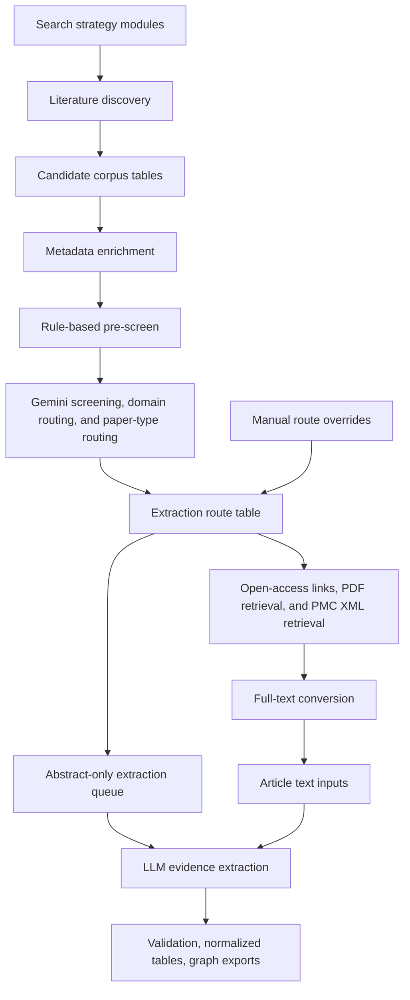

# Pipeline

This pipeline builds a reproducible literature corpus for the psychedelics
knowledge graph, screens papers for relevance, retrieves available full text,
and prepares clean inputs for structured evidence extraction.

This README is the living operational map for the current pipeline. When a
step changes, update this file first, then update the narrower stage README if
the change affects a specific script family.

The pipeline should be described by its actions, not by historical run labels.
Run labels such as `boolean_full_v1` or `pairwise_direct_v1` are provenance
labels for specific searches, not pipeline stages.

## Current Workflow



1. **Search planning** defines grouped domain searches and targeted direct-pair
   searches from the current compound, intervention, clinical, molecular,
   brain-system, cognitive-behavioral, safety, pharmacology, intervention, and
   public-health vocabularies.
2. **Literature discovery** queries the selected literature sources and stores
   source/run provenance for every retrieved DOI. Duplicate DOIs are deduplicated
   at the corpus level, but their search-source provenance is retained.
3. **Corpus table build** normalizes discovered records into the table-native
   corpus under `data/processed/corpus/`, especially `candidate_papers.parquet`,
   `candidate_contexts.parquet`, and `candidate_sources.parquet`.
4. **Metadata enrichment** adds titles, abstracts, publication metadata,
   publication-type labels, identifiers, open-access status, and PDF URL
   candidates. Provider roles are explicit: bibliographic metadata and
   abstracts, PubMed publication types, and open-access/PDF-link discovery are
   refreshed as separate passes.
5. **Rule-based pre-screening** removes only records that clearly lack usable
   title/abstract evidence or clearly fall outside the project scope. It writes
   decisions to `paper_prescreen_decisions.parquet` and can be rerun for the
   whole corpus or a DOI subset.
6. **Gemini screening, domain routing, and paper-type routing** uses Gemini on
   title, abstract, and minimal supporting metadata to decide whether each
   pre-screen-retained record is in scope, assign evidence domains, and classify
   the paper as primary/unclear, secondary literature, or non-primary
   publication with a more specific paper type.
7. **Extraction route assembly** combines pre-screen decisions, Gemini routing,
   converted full-text artifacts, valid PDFs in the canonical PDF store, PDF
   URLs, and narrow manual overrides into
   `paper_extraction_routes.parquet`. This table is the current extraction
   queue source.
8. **Full-text handling** refreshes open-access links, downloads available legal
   PDFs, retrieves reusable PMC XML when available, and converts local full-text
   sources into structured artifacts. Records without usable full text remain
   eligible for the abstract-only extraction path when the route table marks
   them as extraction candidates.
10. **Evidence extraction** uses route-specific LLM prompts and schemas for
    primary studies, secondary literature, guideline/consensus records, and
    abstract-only records.
11. **Validation and publishing** checks extracted evidence against schemas and
    evidence-policy rules, normalizes graph tables, and exports public graph,
    bibliography, and methods-flow payloads.

Generated Parquet tables are rebuildable. Durable decisions should live in
tracked code, configuration, search strategy files, model prompts, or small
manual-review files such as `pipeline/extract/manual_extraction_route_overrides.json`
and `pipeline/fulltext/manual_fulltext_access_overrides.json`.
CSV audit files are human-readable inspection artifacts unless a script
explicitly takes them as input.

## Main Commands

### Search Planning

Build the current search files from configured registries:

```bash
python pipeline/ingest/build_boolean_search_modules.py --dataset all --run-id search_2026_05
python pipeline/ingest/build_comprehensive_search_plan.py --dataset all --profile standard --run-id search_2026_05
```

The script names still contain some older implementation wording. In methods
text, describe these as **grouped search modules** and **direct pair searches**.
If `--run-id` is omitted, scripts write to the neutral
`data/raw/search_strategies/literature_search/` run directory.

### Literature Discovery

Run grouped search modules or direct pair-search files through
`discover_literature.py` or the batch runners in `pipeline/ingest/`.

Example:

```bash
python pipeline/ingest/discover_literature.py \
  --dataset mechanistic \
  --provider pubmed \
  --seed-file data/raw/search_strategies/search_2026_05/grouped_modules/mechanistic_grouped_pubmed_seeds.csv \
  --max-results-per-seed 500 \
  --max-results 0
```

### Corpus Table Build

```bash
python pipeline/validate/build_context_provenance_audit.py \
  --table-out-dir data/processed/corpus
```

This writes `candidate_papers.parquet`, `candidate_contexts.parquet`,
`candidate_sources.parquet`, and `candidate_corpus_manifest.parquet`.
Rediscovered papers are deduplicated by DOI at the paper level while keeping
their source/query provenance in the context and source tables.

### Metadata Enrichment

Run role-aware metadata enrichment on the corpus table:

```bash
python pipeline/ingest/run_standard_metadata_enrichment.py \
  --dataset all \
  --write-every 100 \
  --progress-every 100
```

This writes `paper_metadata_enrichment.parquet`. Core metadata and abstracts
are refreshed separately from PubMed publication types and open-access/PDF URL
candidates. The default provider roles are controlled in
`run_standard_metadata_enrichment.py`: core metadata uses
PubMed/PMC/OpenAlex/Crossref/Semantic Scholar fallbacks, publication types come
from PubMed, and open-access/PDF links use Unpaywall/OpenAlex/PMC.

Scope a small update with `--doi-file <doi_list>` rather than rerunning the
whole table.

### Rule-Based Pre-Screen

```bash
python pipeline/review/run_deterministic_prescreen.py \
  --run-id deterministic_prescreen_YYYY_MM_DD
```

This writes `paper_prescreen_decisions.parquet` and
`paper_prescreen_summary.parquet`. It excludes only clear title/abstract
no-signal records, unusable abstract artifacts, and records that are clearly
outside scope. Use `--doi-file <doi_list>` or repeated `--doi <doi>` for scoped
updates.

The older local LLM abstract-screening scripts remain in `pipeline/review/` for
audit and comparison, but they are not the current extraction gate.

### Gemini Domain Routing

Prepare batch requests:

```bash
python pipeline/review/build_gemini_domain_routing_batch_queue.py --prepare
```

Advance the queue one submitted part at a time:

```bash
python pipeline/review/advance_gemini_domain_routing_batch_queue.py
```

This writes `paper_domain_routing_gemini.parquet`,
`paper_domain_routing_gemini_summary.json`, and
`paper_domain_routing_gemini_counts.csv`. The Gemini response includes
`screening_decision`, `domain_tags`, `primary_domain`, `paper_type_group`, and
`paper_type`; this table is the source of paper type for new extraction routes.

### Extraction Routes

```bash
python pipeline/extract/build_extraction_routes.py \
  --domain-routing-table data/processed/corpus/paper_domain_routing_gemini.parquet
```

This writes `paper_extraction_routes.parquet`,
`paper_extraction_routes_summary.json`, and
`paper_extraction_routes_counts.csv`. Preprint and unpublished posted-content
records are excluded before routing by deterministic pre-screening, and the
route build treats the pre-screen table as authoritative. The build also
applies two narrow DOI-level manual review files:

- `pipeline/extract/manual_extraction_route_overrides.json` for route/domain
  decisions such as context-only, conference abstracts, corrections, or
  non-article records.
- `pipeline/fulltext/manual_fulltext_access_overrides.json` for access
  decisions such as suppressing a misleading probable-PDF URL after manual
  review confirms there is no usable open article PDF.

The build also updates `candidate_papers.parquet` as the DOI-level pipeline
ledger. It backfills publication-stage fields, pre-screen summaries, Gemini
paper-type/domain summaries, extraction-route status, route counts, prompt and
schema profiles, manual full-text access decisions, and the best available text
tier. The detailed many-row route assignments stay in
`paper_extraction_routes.parquet`; `candidate_papers.parquet` keeps one row per
DOI for corpus accounting and PRISMA-style counts.

Access tiers are intentionally operational:

- `full_text_available`: converted full-text artifact exists locally.
- `local_pdf_available`: valid PDF exists in `data/raw/papers/pdfs/`, but
  conversion is still needed.
- `pdf_download_url_available`: a metadata-derived URL looks like a direct PDF
  endpoint, but no valid local PDF or converted full text has been found yet.
- `abstract_only`: no local full text, local PDF, or probable PDF download URL is
  currently available. Weaker landing-page or repository URLs are still kept in
  the corpus table for manual access checks.

### Canonical PDF Store

The current pipeline stores active source PDFs in one canonical directory:

```text
data/raw/papers/pdfs/
```

The old `data/raw/papers/mechanistic/pdfs/` and
`data/raw/papers/disorder/pdfs/` folders are legacy scaffolding and should stay
empty for the table-native pipeline. Same-DOI alternate PDFs are preserved under
`data/raw/papers/pdf_conflicts/`; files with `.pdf` names that are not valid PDF
content are kept under `data/raw/papers/invalid/`.

To reconcile the file store and corpus table:

```bash
python pipeline/fulltext/migrate_pdf_store.py --mode move --apply --move-conflicts
```

Run without `--apply` for a dry run. The script updates
`candidate_papers.parquet` so `pdf_local_path`, `local_pdf_paths`, and
`local_pdf_count` reflect only the canonical PDF store.

### Open-Access Links And PDF Retrieval

Refresh PDF URL candidates for routed extraction candidates:

```bash
python pipeline/ingest/refresh_open_access_links.py \
  --routing-table data/processed/corpus/paper_extraction_routes.parquet \
  --only-missing-pdf-url \
  --provider-order unpaywall,openalex,pmc \
  --progress-every 100
```

Use the route table to keep PDF download attempts scoped to retained extraction
candidates and to avoid retrying known closed-access or already-downloaded
records.

Run the standard routed PDF retrieval stage:

```bash
python pipeline/fulltext/run_pdf_retrieval_pipeline.py \
  --route-table data/processed/corpus/paper_extraction_routes.parquet \
  --progress-every 25 \
  --write-every 25
```

This step targets retained `download_pdf_then_extract` papers, deduplicates by
DOI, writes successful downloads to `data/raw/papers/pdfs/`, and updates
`candidate_papers.parquet` with the canonical local PDF path and checksum. It
then runs the standard repository recovery pass for OSF/PsyArXiv and
Figshare-style records, rebuilds `paper_extraction_routes.parquet`, and exports
the remaining manual-download queue to
`data/processed/corpus/audits/manual_pdf_download_dois.csv/.txt`. Use
`--dry-run` to inspect the direct-download queue before network calls, and
`--limit <N>` for a small pilot. Use `--skip-standard-recovery` for debugging
when only the direct downloader should run. The runner prints an immediate
queue summary, logs each DOI before and after its direct download attempt, and
logs candidate-URL attempts/results by default. For
quieter supervised runs, set `--attempt-log-every <N>`,
`--candidate-log-every <N>`, or use `0` for either option; use
`--progress-every <N>` for aggregate progress summaries.
The route builder and downloader distinguish probable PDF endpoints from weaker
landing-page or repository links. Automated downloads use probable PDF URLs by
default; weaker links stay visible as `other_url_candidates` for refreshed link
discovery or manual download. Use `--include-weak-pdf-urls` only for diagnostic
or manually supervised recovery runs.

By default, the downloader interleaves queued papers by primary PDF host instead
of processing table order. This avoids sending long consecutive runs of requests
to one repository or publisher, which reduces avoidable rate limiting while
still keeping all papers in the same first-pass retrieval stage. If a host
returns a temporary failure such as a rate-limit response, timeout, or 5xx
provider error, only that host is cooled down; alternative PDF candidate URLs
for the same DOI can still be tried. Use `--preserve-task-order` only for
diagnostics where deterministic table order is required.
The downloader records `pdf_download_failure_category`,
`pdf_download_failure_categories`, `pdf_download_error`, and
`pdf_download_retry_recommended` in `candidate_papers.parquet`. Retry only
temporary categories such as `rate_limited`, `provider_error`, and `timeout`;
do not repeatedly retry `forbidden`, `not_found`, `non_pdf_response`, or
`weak_pdf_url_only` unless new PDF URLs have been refreshed.

For low-level debugging, the direct downloader and repository-recovery steps can
still be run separately:

```bash
python pipeline/fulltext/download_routed_pdfs.py \
  --limit 25 \
  --alternate-pdf-sources pmc,openalex,semantic_scholar
python pipeline/fulltext/recover_pdf_landing_pages.py \
  --standard-recovery-only \
  --categories forbidden,non_pdf_response,provider_error,timeout,other_download_failure,not_found
python pipeline/fulltext/export_manual_pdf_queue.py
```

For explicit post-direct cleanup of publisher landing pages known to expose
downloadable same-host PDFs, use a named rescue preset instead of making broad
host probing the default retrieval path:

```bash
python pipeline/fulltext/recover_pdf_landing_pages.py \
  --rescue-preset akjournals \
  --apply \
  --rebuild-routes-after
python pipeline/fulltext/export_manual_pdf_queue.py
python pipeline/fulltext/rank_manual_pdf_queue.py
```

For normal-browser click-through recovery, configure Chrome or the save dialog
to write into `data/raw/papers/manual_pdf_inbox/` rather than the general
Downloads folder. Treat article pages as a click-through ladder: first open
controls such as "Article", "Full text", "View article", or "Read article" when
the PDF button is not yet visible, then look for "PDF", "Download PDF", "View
PDF", or the browser PDF-viewer download control. Before importing, triage the
browser output so HTML paywall, cookie, and other non-PDF saves are classified
and moved out of the inbox:

```bash
python pipeline/fulltext/browser_download_triage.py \
  --download-dir data/raw/papers/manual_pdf_inbox \
  --quarantine-non-pdf \
  --apply
python pipeline/fulltext/import_manual_pdfs.py \
  --inbox-dir data/raw/papers/manual_pdf_inbox \
  --apply \
  --move
```

If a manually inspected inbox PDF is known to replace an incorrect canonical
PDF for the same DOI, add `--replace-existing`; the prior canonical file is
backed up under `data/raw/papers/pdf_conflicts/` before replacement.

Visible browser states such as "Get access", "Log in", or "you do not have
access" should be recorded as `no_access_or_paywalled` instead of retried as
PDF downloads.

After importing manual PDFs or adding access/route overrides, rebuild routes,
convert any newly local PDFs, and refresh the manual queue exports:

```bash
python pipeline/extract/build_extraction_routes.py
python pipeline/fulltext/run_local_pdf_conversion_pipeline.py --batch-size 25
python pipeline/fulltext/export_manual_pdf_queue.py
python pipeline/fulltext/rank_manual_pdf_queue.py
```

When manual review confirms that a remaining DOI has no usable open article
PDF, add `manual_access_action=suppress_pdf_download` in
`pipeline/fulltext/manual_fulltext_access_overrides.json` and rebuild routes.
When manual review confirms a record is not an extractable article, add
`manual_action=context_only` in
`pipeline/extract/manual_extraction_route_overrides.json` and rebuild routes.

Backfill failure categories from existing routed download reports and legacy
paper-library failure text:

```bash
python pipeline/fulltext/backfill_pdf_failure_categories.py
```

Example recovery pass:

```bash
python pipeline/fulltext/download_routed_pdfs.py \
  --only-failure-categories rate_limited,provider_error,timeout \
  --skip-candidate-statuses downloaded,already_present,manual_import \
  --rate-limit-cooldown-sec 30 \
  --timeout-sec 45 \
  --max-retries 1
```

### Full-Text Conversion

For retained papers with a PMCID but no converted full text and no local PDF,
retrieve reusable PMC XML before treating the record as abstract-only:

```bash
python pipeline/fulltext/fetch_pmc_fulltext_xml.py \
  --progress-every 25 \
  --rps 1.5
```

The script tries the Europe PMC XML endpoint first and then PMC OAI/JATS. It
writes successful XML into the canonical article-text store,
`data/processed/fulltext/articles/`, using the same artifact shape as PDF
conversion. After a real run writes artifacts, it rebuilds
`paper_extraction_routes.parquet` automatically, so successful XML records move
to `full_text_available` and are not kept in the PDF-download queue.

Local PDFs are converted into structured full-text artifacts before article-text
LLM extraction. The default backend is GROBID, which parses scholarly articles
into TEI XML so downstream model inputs can preserve sections, tables, figures,
references, and stable evidence locators.

```bash
python pipeline/fulltext/convert_routed_local_pdfs.py \
  --backend grobid
```

Existing legacy artifacts from `fulltext/disorder/`, `fulltext/mechanistic/`,
and `fulltext/pmc_xml/` can be copied once into the canonical store without
re-extracting PDFs:

```bash
python pipeline/fulltext/consolidate_fulltext_artifacts.py
```

`paper_extraction_routes.parquet` reads converted article text only from
`data/processed/fulltext/articles/<doi_slug>.json`. The old split directories
are migration sources for `consolidate_fulltext_artifacts.py` only; route
building does not use them as fallbacks.

### Article Text Input Preparation

The extraction route table is the source of truth for the next extraction run.
Build route-specific article text inputs from `paper_extraction_routes.parquet`
and the canonical `fulltext/articles/` artifacts:

```bash
python pipeline/fulltext/build_article_text_inputs.py
```

The default section policy keeps primary studies focused on methods/results and
uses all extracted sections for meta-analyses and reviews.

Then build route-specific task records. These records preserve `route_id` as the
stable extraction-job key, because one DOI can have multiple domain-specific
extraction routes.

```bash
python pipeline/extract/build_extraction_tasks.py
```

Before model calls, audit selected article text from the canonical
`fulltext/articles/` store:

```bash
python pipeline/fulltext/audit_article_text_inputs.py \
  --per-strategy 3
```

Route-specific article text builders should use `fulltext_artifact_paths` from
`paper_extraction_routes.parquet` and preserve route fields such as
`source_family`, `source_type`, `domain_route`, `access_tier`, `route_action`,
`prompt_profile`, and `schema_profile`. Current JSON fields may still use
`packet_profile` internally for compatibility; new prose should use article
text input and section selection strategy.

The route-table-based meta-analysis profile uses paper-type/text-depth prompts under
`docs/extraction_profiles/paper_type/` plus meta-analysis domain schemas under
`schema/extraction_profiles/meta_analysis/`; the same domain schema is used for
article-text and abstract-only meta-analysis tasks. `schema/meta_analysis_evidence.schema.json`
is the shared base contract. Primary and secondary-review profiles also have
schemas/prompts in the registry, but secondary-review prompts remain scaffolded
until each domain is tuned.
Guideline, context-only, and no-extraction routes are terminal audit routes and
are not sent to a model.

Not every routed paper is a KG contribution. Primary evidence routes produce KG
candidate evidence after normalization; meta-analyses produce separate
meta-analysis evidence; secondary reviews can produce coverage/evidence-map context; and
guideline, context-only, or no-extraction routes are retained for
corpus/accounting audit rather than graph edges.

Inspect the registered route-aware extraction tasks without model calls:

```bash
python pipeline/extract/run_route_extraction.py \
  --prompt-profile secondary_meta_analysis \
  --schema-profile meta_analysis_evidence_schema \
  --dry-run
```

### Evidence Extraction

Run extraction pilots before scaling a full batch:

```bash
python pipeline/extract/run_gemini_extraction_v1.py \
  --input-jsonl <route-specific-pilot-inputs.jsonl> \
  --out-jsonl data/processed/extraction/extraction_v1_outputs.jsonl \
  --raw-jsonl data/processed/extraction/extraction_v1_gemini_raw.jsonl \
  --report-json data/processed/extraction/extraction_v1_gemini_report.json
```

## Canonical Outputs

- `data/raw/doi_queue.<dataset>.discovered.txt`
- source/provider discovery reports under `data/raw/search_strategies/` and
  `data/processed/`
- `data/processed/corpus/candidate_papers.parquet`
- `data/processed/corpus/candidate_contexts.parquet`
- `data/processed/corpus/candidate_sources.parquet`
- `data/processed/corpus/paper_metadata_enrichment.parquet`
- `data/processed/corpus/paper_prescreen_decisions.parquet`
- `data/processed/corpus/paper_domain_routing_gemini.parquet`
- `data/processed/corpus/paper_extraction_routes.parquet`
- `data/processed/fulltext/articles/*.json`
- `data/processed/extraction/*_fulltext_packets.jsonl` compatibility files
  containing article text inputs
- `data/processed/extraction/extraction_v1_outputs*.jsonl`
- normalized graph and bibliography payloads under `data/kg/`,
  `data/processed/`, and `ui/`

## Run Labels

Use run labels to separate artifacts from different searches or batches:

- Good labels describe the run: `grouped_search_2026_05`,
  `direct_pairs_2026_05`, `monthly_update_2026_06`.
- Historical labels such as `boolean_full_v1`, `pairwise_direct_v1`, and
  `comprehensive_baseline_v1` are retained only so existing outputs remain
  reproducible.
- Do not use run labels as public method names.

## Corpus Tables

`data/processed/corpus/` contains the current table-based corpus. Downstream
steps should query these tables instead of large JSON snapshots.

The raw run reports remain append-only provenance. The files under
`data/processed/extraction/` are current views regenerated from corpus tables
and full-text artifacts.

Current corpus storage direction: use normalized Parquet tables for papers,
contexts, source/provenance events, and metadata enrichment. Later, load those
normalized tables into Postgres for website search, API queries, and MCP-facing
paper/KG access.

Build the current normalized candidate corpus tables:

```bash
python pipeline/validate/build_context_provenance_audit.py \
  --table-out-dir data/processed/corpus
```

This writes `candidate_papers.parquet`, `candidate_contexts.parquet`,
`candidate_sources.parquet`, and `candidate_corpus_manifest.parquet`.

## Local Config

Keep credentials in the ignored local config:

```bash
cp pipeline/config.local.example.yaml pipeline/config.local.yaml
chmod 600 pipeline/config.local.yaml
```

Common settings:

- `openalex.api_key`
- `pubmed.email`
- `pubmed.api_key`
- `crossref.email`
- `unpaywall.email`
- `semantic_scholar.api_key`

Scripts that use `pipeline/config.example.yaml` automatically overlay
`pipeline/config.local.yaml` when it exists.

## Legacy Maintenance Path

The first-generation graph used context-level stubs, autofill scripts, and
promotion into curated evidence-record files. Those tools remain under
`pipeline/review/` and `pipeline/extract/promote_ready_stubs.py` for maintenance
and comparison, but new KG evidence should flow through the route table and
route-specific article text inputs first.
